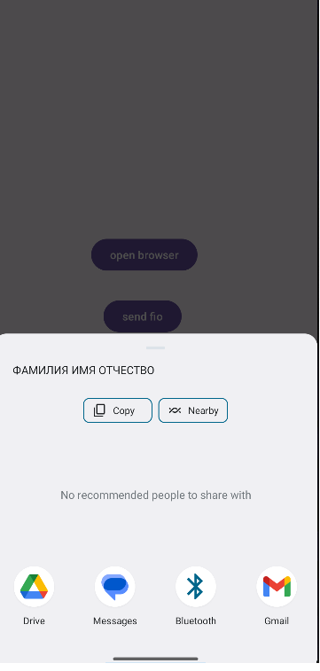
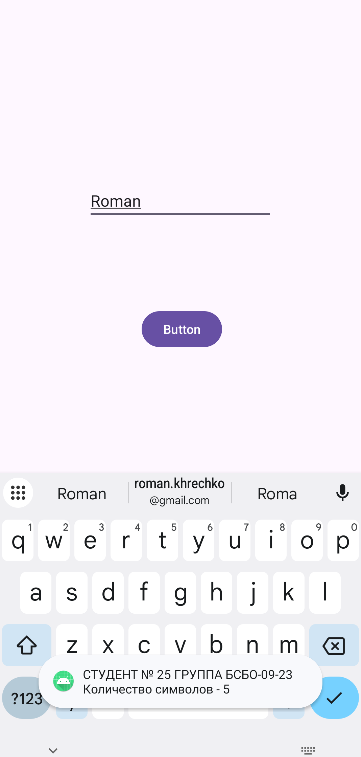
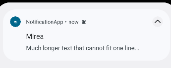
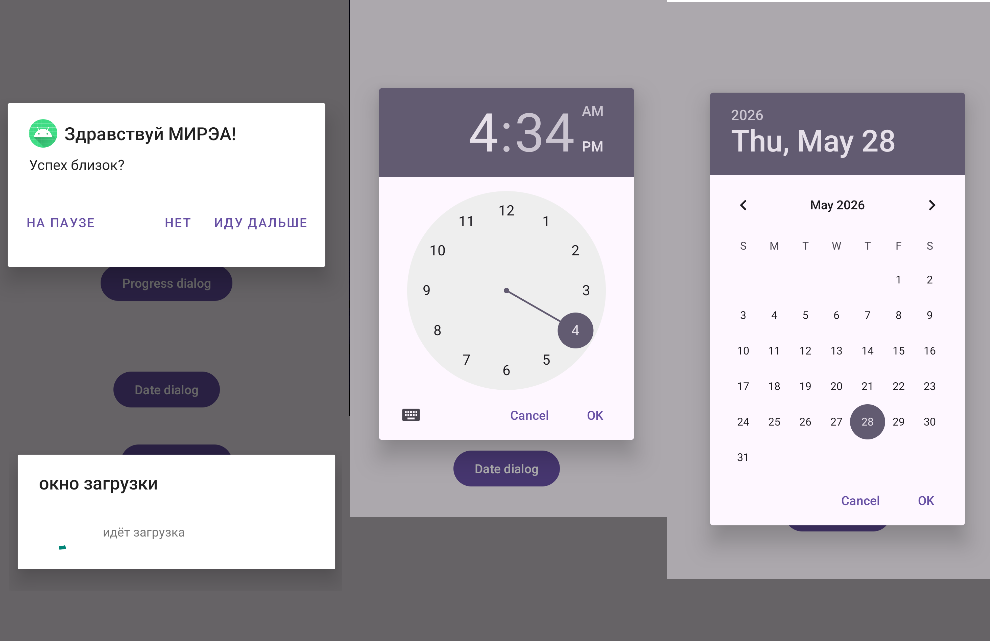

# Отчет по практической работе №2
## Дисциплина: Разработка мобильных приложений

**Выполнил:** Студент группы БСБО-09-23  
**ФИО:** Хречко Роман Викторович  
**Номер по списку:** 25

---

## 1. Цель работы

Изучение жизненный цикл `Activity` на Android, все отдельные этапы, которые происходят при создании, использовании и закрытии приложения.
Изучить создание перехода между активностями для создания много экранных приложений с помощью Intent.
Создание различных уведомлений пользователю с помощью `Toast`, `Notification` и `Dialog`.

## 2. Структура проекта
В практической работе будут созданы 6 модулей для выполнения каждого задания:
1. `ActivityLifecycle` — изучение методов жизненного цикла приложения.
2. `MultiActivity` — явные вызовы Activity и передача данных через Intent.
3. `IntentFilter` — неявные вызовы (браузер, системное меню "Поделиться").
4. `ToastApp` — работа со всплывающими подсказками.
5. `NotificationApp` — создание каналов и отправка Push-уведомлений.
6. `Dialog` — работа с фрагментами диалоговых окон (AlertDialog, TimePicker, DatePicker, ProgressDialog) и Snackbar.

---

## 3. Выполнение работы

### Задание 1. `ActivityLifecycle`
В классе `MainActivity` были перезаписаны все методы жизненного цикла. Был создан отдельный тэг названия класса,
чтобы передавать его в вызовы в лог, с помощью метода `Log.i`. Данный метод был добавлен для каждого метода жизненного цикла.
Каждое сообщение в лог сообщает из какого метода был получен, для представления в каком порядке происходят вызовы.

**Листинг `MainActivity.java`:**
```Java
public class MainActivity extends AppCompatActivity {

    private String TAG = MainActivity.class.getSimpleName();

    @Override
    protected void onCreate(Bundle savedInstanceState) {
        super.onCreate(savedInstanceState);
        EdgeToEdge.enable(this);
        setContentView(R.layout.activity_main);
        Log.i(TAG, "onCreate()");
        ViewCompat.setOnApplyWindowInsetsListener(findViewById(R.id.main), (v, insets) -> {
            Insets systemBars = insets.getInsets(WindowInsetsCompat.Type.systemBars());
            v.setPadding(systemBars.left, systemBars.top, systemBars.right, systemBars.bottom);
            return insets;
        });
    }

    @Override
    protected void onStart() {
        super.onStart();
        Log.i(TAG, "onStart()");
    }

    @Override
    protected void onRestoreInstanceState(@NonNull Bundle savedInstanceState) {
        super.onRestoreInstanceState(savedInstanceState);
        Log.i(TAG, "onRestoreInstanceState()");
    }

    @Override
    protected void onPostCreate(@Nullable Bundle savedInstanceState) {
        super.onPostCreate(savedInstanceState);
        Log.i(TAG, "onPostCreate()");
    }

    @Override
    protected void onResume() {
        super.onResume();
        Log.i(TAG, "onResume()");
    }

    @Override
    protected void onPostResume() {
        super.onPostResume();
        Log.i(TAG, "onPostResume()");
    }

    @Override
    public void onAttachedToWindow() {
        super.onAttachedToWindow();
        Log.i(TAG, "onAttachedToWindow()");
    }

    @Override
    protected void onPause() {
        super.onPause();
        Log.i(TAG, "onPause()");
    }

    @Override
    protected void onSaveInstanceState(@NonNull Bundle outState) {
        super.onSaveInstanceState(outState);
        Log.i(TAG, "onSaveInstanceState()");
    }

    @Override
    protected void onStop() {
        super.onStop();
        Log.i(TAG, "onStop()");
    }

    @Override
    protected void onDestroy() {
        super.onDestroy();
        Log.i(TAG, "onDestroy()");
    }

    @Override
    public void onDetachedFromWindow() {
        super.onDetachedFromWindow();
        Log.i(TAG, "onDetachedFromWindow()");
    }

    @Override
    protected void onRestart() {
        super.onRestart();
        Log.i(TAG, "onRestart()");
    }
}
```

####  Ответы на контрольные вопросы:

1. Будет ли вызван метод «onCreate» после нажатия на кнопку «Home» и возврата в приложение? - нет, данный метод вызывается
только при создании приложения, так как кнопка Home не уничтожает приложение, то оно не будет пересоздано
2. Изменится ли значение поля «EditText» после нажатия на кнопку «Home» и возврата в приложение? - нет, поле сохраняется
при переходе в фоновый режим, так что при следующем открытии значение будет восстановлено из сохранения.
3. Изменится ли значение поля «EditText» после нажатия на кнопку «Back» и возврата в приложение? - нет, кнопка Back
выполняет схожий функционал, как и кнопка Home, приложение также перейдёт в фоновый режим, а не закроется полностью.

### Задание 2. `MultiActivity`

В данном модуле создается приложение, которое переходит между несколькими активностями с помощью `Intent`. Для передачи
значений используется метод `putExtra`, который передаёт значение по ключу. При нажатии на кнопку в `MainActivity` происходит
переход в `SecondActivity`, а значение строки заполняется значением, полученным при переходе.

**Листинг MainActivity.java:**
```Java
public void onClickNewActivity(View view) {
        Intent intent = new Intent(this, SecondActivity.class);
        intent.putExtra("key", "MIREA - Хречео Роман Викторович");
        startActivity(intent);
    }
```

**Листинг SecondActivity.java:**
```Java
    @Override
    protected void onCreate(Bundle savedInstanceState) {
        super.onCreate(savedInstanceState);
        EdgeToEdge.enable(this);
        setContentView(R.layout.activity_second);
        TextView textView = findViewById(R.id.textView);
        Log.i(TAG, "onCreate()");
        textView.setText((String) getIntent().getSerializableExtra("key"));
        ViewCompat.setOnApplyWindowInsetsListener(findViewById(R.id.main), (v, insets) -> {
            Insets systemBars = insets.getInsets(WindowInsetsCompat.Type.systemBars());
            v.setPadding(systemBars.left, systemBars.top, systemBars.right, systemBars.bottom);
            return insets;
        });
    }
```

### Задание 3. `IntentFilter`

С помощью неявных намерений реализовано открытие вебстраницы и отправка в другие приложения. В данном случае приложение
не обращается к конкретному приложению, а сообщает, что новое приложение должно выполнить. В случае вебстраницы откроется
стандартный браузер.



**Листинг MainActivity.java:**

```Java
  public void OpenBrowser(View view){
        Uri address = Uri.parse("https://www.mirea.ru/");
        Intent openLinkIntent = new Intent(Intent.ACTION_VIEW, address);
        startActivity(openLinkIntent);
    }

    public void SendFIO(View view){
        Intent shareIntent = new Intent(Intent.ACTION_SEND);
        shareIntent.setType("text/plain");
        shareIntent.putExtra(Intent.EXTRA_SUBJECT, "MIREA");
        shareIntent.putExtra(Intent.EXTRA_TEXT, "ФАМИЛИЯ ИМЯ ОТЧЕСТВО");
        startActivity(Intent.createChooser(shareIntent, "МОИ ФИО"));
    }
```

### Задание 4. `ToastApp`

В данном модуле изучается вывод небольших сообщений `Toast`, для сообщения пользователю. Был реализован метод, который при
нажатии на кнопку выведет длину текста в поле ввода.



**Листинг MainActivity.java:**

```Java
    public void CalculateLength(View view){
        Toast toast = Toast.makeText(getApplicationContext(),
                "СТУДЕНТ № 25 ГРУППА БСБО-09-23 Количество символов - " + textEdit.getText().length(),
                Toast.LENGTH_SHORT);
        toast.show();
    }
```

### Задание 5. `NotificationApp`

Для создания уведомления сначала в методе `onCreate` происходит проверка наличия прав на отправку уведомлений.
После этого метод `onClickSendNotification` при нажатии на кнопку создаёт уведомление с выбранными данными.


**Листинг MainActivity.java:**

```Java
public class MainActivity extends AppCompatActivity {
    private static final String CHANNEL_ID = "com.mirea.asd.notification.ANDROID";

    private int PermissionCode = 200;
    @RequiresApi(api = Build.VERSION_CODES.TIRAMISU)
    @Override
    protected void onCreate(Bundle savedInstanceState) {
        super.onCreate(savedInstanceState);
        EdgeToEdge.enable(this);
        setContentView(R.layout.activity_main);
        if (ContextCompat.checkSelfPermission(this, POST_NOTIFICATIONS) == PackageManager.PERMISSION_GRANTED) {
            Log.d(MainActivity.class.getSimpleName().toString(), "Разрешения получены");
        } else {
            Log.d(MainActivity.class.getSimpleName().toString(), "Нет разрешений!");
            ActivityCompat.requestPermissions(this, new String[]{Manifest.permission.POST_NOTIFICATIONS}, PermissionCode);
        }
        ViewCompat.setOnApplyWindowInsetsListener(findViewById(R.id.main), (v, insets) -> {
            Insets systemBars = insets.getInsets(WindowInsetsCompat.Type.systemBars());
            v.setPadding(systemBars.left, systemBars.top, systemBars.right, systemBars.bottom);
            return insets;
        });
    }

    public void onClickSendNotification(View view){
        if (ActivityCompat.checkSelfPermission(this, Manifest.permission.POST_NOTIFICATIONS) != PackageManager.PERMISSION_GRANTED) {
            return;
        }
        NotificationCompat.Builder builder = new NotificationCompat.Builder(this, CHANNEL_ID)
                .setContentText("Congratulation!")
                .setSmallIcon(R.drawable.ic_launcher_foreground)
                .setPriority(NotificationCompat.PRIORITY_HIGH)
                .setStyle(new NotificationCompat.BigTextStyle()
                        .bigText("Much longer text that cannot fit one line..."))
                .setContentTitle("Mirea");
        int importance = NotificationManager.IMPORTANCE_DEFAULT;
        NotificationChannel channel = new NotificationChannel(CHANNEL_ID, "Student FIO Notification", importance);
        channel.setDescription("MIREA Channel");
        NotificationManagerCompat notificationManager = NotificationManagerCompat.from(this);
        notificationManager.createNotificationChannel(channel);
        notificationManager.notify(1, builder.build());
    }
}
```

### Задание 6. `Dialog`

В данном модуле создаётся несколько дополнительных диалоговых окон, которые ожидают ввода от пользователя и
блокируют другой ввод в это время. Были созданы 4 диалоговых окна:
1. `AlertDialogFragment` - окно с 3 кнопками, при нажатии на любое окно закрывается, а с помощью `Toast` отображается
какая кнопка была нажата.
2. `MyTimeDialogFragment` - окно с выбором часа и минуты, после закрытия сообщается выбранное время с помощью
современного аналога `Toast` - `SnackBox`.
3. `MyDateDialogFragment` - аналогично выбору времени, но этот класс позволяет выбрать дату.
4. `MyProgressDialogFragment` - открывает окно, которое отображает вечную загрузку. При закрытии этого окна,
при нажатии на другое место на экране вызовется сообщение о закрытии окна.



**Листинг AlertDialogFragment.java:**

```Java
@NonNull
    @Override
    public Dialog onCreateDialog(@Nullable Bundle savedInstanceState) {
        AlertDialog.Builder builder = new AlertDialog.Builder(getActivity());
        builder.setTitle("Здравствуй МИРЭА!")
                .setMessage("Успех близок?")
                .setIcon(R.mipmap.ic_launcher_round)
                .setPositiveButton("Иду дальше", new DialogInterface.OnClickListener() {
                    public void onClick(DialogInterface dialog, int id) {
                        // Закрываем окно
                        ((MainActivity)getActivity()).onOkClicked();
                        dialog.cancel();
                    }
                })
                .setNeutralButton("На паузе", new DialogInterface.OnClickListener() {
                            public void onClick(DialogInterface dialog, int id) {
                                ((MainActivity)getActivity()).onNeutralClicked();
                                dialog.cancel();
                            }
                        })
                .setNegativeButton("Нет", new DialogInterface.OnClickListener() {
                            public void onClick(DialogInterface dialog, int id) {
                                ((MainActivity)getActivity()).onCancelClicked();
                                dialog.cancel();
                            }
                        });
        return builder.create();
    }
```

**Листинг MyTimeDialogFragment.java:**

```Java
 @NonNull
    @Override
    public Dialog onCreateDialog(@Nullable Bundle savedInstanceState) {

        Calendar c = Calendar.getInstance();
        int hour = c.get(Calendar.HOUR_OF_DAY);
        int minute = c.get(Calendar.MINUTE);

        return new TimePickerDialog(getActivity(), this, hour, minute,
                DateFormat.is24HourFormat(getActivity()));
    }

    @Override
    public void onTimeSet(TimePicker view, int hourOfDay, int minute) {
        ((MainActivity)getActivity()).onTimePicked(hourOfDay, minute);
    }
```

**Листинг MyDateDialogFragment.java:**

```Java
 @NonNull
    @Override
    public Dialog onCreateDialog(@Nullable Bundle savedInstanceState) {
        Calendar c = Calendar.getInstance();
        int year = c.get(Calendar.YEAR);
        int month = c.get(Calendar.MONTH);
        int day = c.get(Calendar.DAY_OF_MONTH);

        // Создаем новый экземпляр DatePickerDialog и возвращаем его
        return new DatePickerDialog(requireContext(), this, year, month, day);
    }

    @Override
    public void onDateSet(DatePicker view, int year, int month, int dayOfMonth) {
        ((MainActivity)getActivity()).onDatePicked(year, month, dayOfMonth);
    }
```

**Листинг MyProgressDialogFragment.java:**

```Java
@NonNull
    @Override
    public Dialog onCreateDialog(@Nullable Bundle savedInstanceState) {
        final ProgressDialog dialog = new ProgressDialog(getActivity());

        dialog.setTitle("окно загрузки");
        dialog.setMessage("идёт загрузка");
        dialog.setIndeterminate(false);
        dialog.setCancelable(true);

        return dialog;
    }

    @Nullable
    @Override
    public void onCancel(DialogInterface dialog) {
        ((MainActivity)getActivity()).onProgressCanceled();
    }
```

## 4. Вывод
В итоге работы были изучены основы, связанные с активностями в Android. Было изучено поведение приложения при открытии,
взаимодействии и закрытии. После этого было разобрано два способа открытия дополнительных активностей с помощью явных и
неявных намерений. Также были изучены инструменты для сообщения пользователю информации. Короткие сообщения с помощью
Toast, уведомления и отдельные диалоговые окна. Было выполнено самостоятельно задание по созданию 3 дополнительных диалоговых
окон с выбором времени, даты и отображения прогресса.
