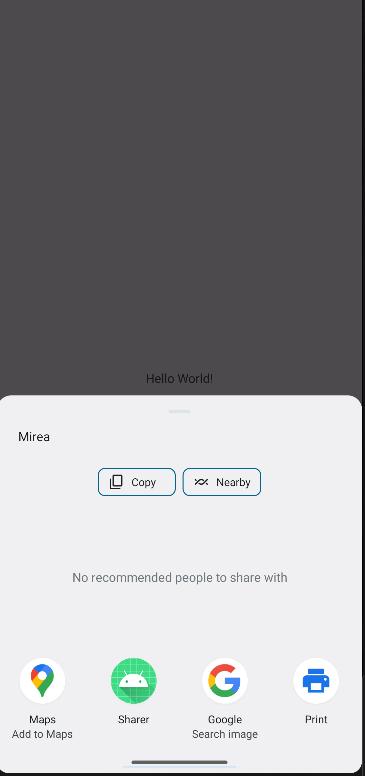
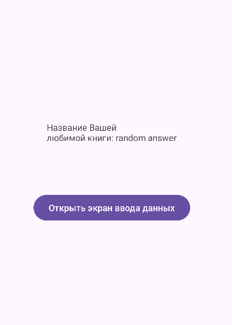
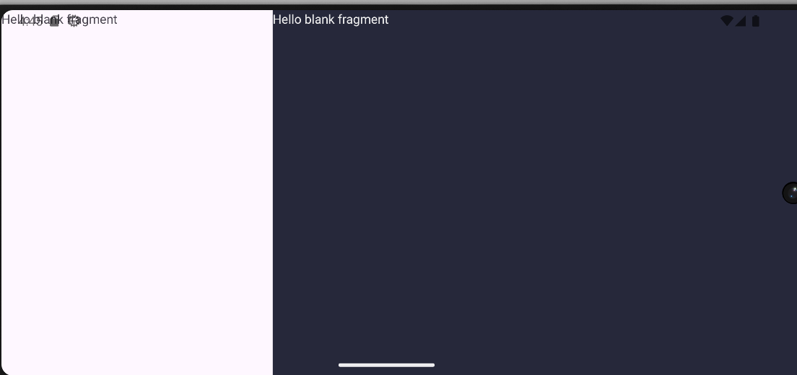
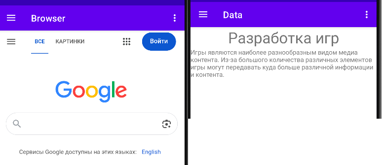

# Отчет по практической работе №3
## Дисциплина: Разработка мобильных приложений

**Выполнил:** Студент группы БСБО-09-23  
**ФИО:** Хречко Роман Викторович  
**Номер по списку:** 25

---

## 1. Цель работы

Изучение взаимодействия между `Activity` и приложениями с помощью `Intent`
(явные и неявные намерения). Изучение передачи данных между экранами, использование
`Activity Result API` для получения результатов из дочерних активностей, а также работа с фрагментами
(`Fragment`) и навигацией в сложных приложениях (`Navigation Drawer`).

## 2. Структура проекта
Работа выполнялась в двух проектах: `Lesson3` для основных заданий и `MireaProject` для дополнительных.

### Проект `Lesson3` (Модули):
1. `IntentApp` — передача данных (системное время).
2. `Sharer` — обмен данными через системное меню (ACTION_SEND).
3. `FavoriteBook` — использование `Activity Result API`.
4. `SystemIntentsApp` — вызов системных приложений (звонки, браузер, карты).
5. `SimpleFragmentApp` — работа с фрагментами и адаптация под ориентацию экрана.

### Проект `MireaProject`:
* Контрольное задание: разработка приложения с боковым навигационным меню (Navigation Drawer) и внедрением WebView.
---

## 3. Выполнение работы

### 3.1 Модуль `IntentApp`
**Цель:** Передача данных через `Intent` и их обработка на втором экране.
В `MainActivity` реализовано получение системного времени в формате `yyyy-MM-dd HH:mm:ss`.
Данные переданы во вторую Activity через `putExtra`.


**Листинг кода (передача данных):**
```Java
long dateInMillis = System.currentTimeMillis();
String format = "yyyy-MM-dd HH:mm:ss";
final SimpleDateFormat sdf = new SimpleDateFormat(format);
String dateString = sdf.format(new Date(dateInMillis));

Intent intent = new Intent(this, SecondActivity.class);
intent.putExtra("integer", "25");
intent.putExtra("date", dateString);
startActivity(intent);
```

### 3.2 Модуль `Sharer`
**Цель:** Использование неявного намерения `ACTION_SEND`.
Приложение вызывает системный диалог выбора приложения для отправки текстовых данных.



**Листинг кода:**
```kotlin
Intent intent = new Intent(android.content.Intent.ACTION_SEND);
intent.setType("*/*");
intent.putExtra(Intent.EXTRA_TEXT, "Mirea");
startActivity(Intent.createChooser(intent, "Выбор за вами!"));
```

### 3.3 Модуль `FavoriteBook`
**Цель:** Получение данных от дочерней активности через `ActivityResult API`.
Реализован контракт `StartActivityForResult`. Главная активность ожидает ввод названия книги от пользователя
во второй активности и обновляет `TextView` после завершения работы второго экрана.



**Листинг класса MainActivity:**
```Java
private ActivityResultLauncher<Intent> activityResultLauncher;
    static final String KEY = "book_name";
    static final String USER_MESSAGE="MESSAGE";
    private TextView textViewUserBook;

    @Override
    protected void onCreate(Bundle savedInstanceState) {
        super.onCreate(savedInstanceState);
        EdgeToEdge.enable(this);

        setContentView(R.layout.activity_main);
        textViewUserBook = findViewById(R.id.textView);
        ActivityResultCallback<ActivityResult> callback = new ActivityResultCallback<ActivityResult>() {
            @Override
            public void onActivityResult(ActivityResult result) {
                if (result.getResultCode() == Activity.RESULT_OK) {
                    Intent data = result.getData();
                    String userBook = data.getStringExtra(USER_MESSAGE);
                    textViewUserBook.setText(String.format("Название Вашей\n" +
                            "любимой книги: %s", userBook));
                }
            }
        };
        activityResultLauncher = registerForActivityResult(
                new ActivityResultContracts.StartActivityForResult(),
                callback);

        ViewCompat.setOnApplyWindowInsetsListener(findViewById(R.id.main), (v, insets) -> {
            Insets systemBars = insets.getInsets(WindowInsetsCompat.Type.systemBars());
            v.setPadding(systemBars.left, systemBars.top, systemBars.right, systemBars.bottom);
            return insets;
        });
    }

    public void getInfoAboutBook(View view) {
        Intent intent = new Intent(this, ShareActivity.class);
        intent.putExtra(KEY, "Гарри Поттер и узник Азкабана");
        activityResultLauncher.launch(intent);
    }
```

**Листинг класса ShareActivity:**
```Java
private EditText inputText;

    @Override
    protected void onCreate(Bundle savedInstanceState) {
        super.onCreate(savedInstanceState);
        EdgeToEdge.enable(this);
        setContentView(R.layout.activity_share);
        inputText = findViewById(R.id.editText);

        Bundle extras = getIntent().getExtras();
        if (extras != null) {
            TextView developerBookText = findViewById(R.id.textView2);
            String developerBook = extras.getString(MainActivity.KEY);
            developerBookText.setText(String.format("Любимая книга разработчика – %s", developerBook));
        }

        ViewCompat.setOnApplyWindowInsetsListener(findViewById(R.id.main), (v, insets) -> {
            Insets systemBars = insets.getInsets(WindowInsetsCompat.Type.systemBars());
            v.setPadding(systemBars.left, systemBars.top, systemBars.right, systemBars.bottom);
            return insets;
        });
    }

    public void SendResult(View view) {
        Intent data = new Intent();
        data.putExtra(MainActivity.USER_MESSAGE, inputText.getText().toString());
        setResult(Activity.RESULT_OK, data);
        finish();
    }
```

### 3.4 Модуль `SystemIntentsApp`
**Цель:** Вызов системных приложений.
Реализованы три сценария:
1. `ACTION_DIAL` (телефонный набор).
2. `ACTION_VIEW` с URI `http` (браузер).
3. `ACTION_VIEW` с URI `geo` (карты).
**Листинг методов для вызова различных запросов:**
```Java
    public void onClickCall(View view) {
        Intent intent = new Intent(Intent.ACTION_DIAL);
        intent.setData(Uri.parse("tel:89811112233"));
        startActivity(intent);
    }
    public void onClickOpenBrowser(View view) {
        Intent intent = new Intent(Intent.ACTION_VIEW);
        intent.setData(Uri.parse("http://developer.android.com"));
        startActivity(intent);
    }
    public void onClickOpenMaps(View view) {
        Intent intent = new Intent(Intent.ACTION_VIEW);
        intent.setData(Uri.parse("geo:55.749479,37.613944"));
    }
```

### 3.5 Модуль `SimpleFragmentApp`
**Цель:** Динамическое управление фрагментами и адаптация под Landscape.
Созданы два фрагмента (`FirstFragment`, `SecondFragment`).
* В вертикальной ориентации переключение реализовано программно через `FragmentManager` и `beginTransaction()`.
* В горизонтальной ориентации (`layout-land`) фрагменты размещены статично с помощью `FragmentContainerView` для отображения обоих фрагментов одновременно.



**Листинг класса MainActivity**
```Java
    Fragment fragment1, fragment2;
    FragmentManager fragmentManager;

    @Override
    protected void onCreate(Bundle savedInstanceState) {
        super.onCreate(savedInstanceState);
        EdgeToEdge.enable(this);
        setContentView(R.layout.activity_main);
        fragment1 = new FirstFragment();
        fragment2 = new SecondFragment();
    }

    public void onClickFirstFragment(View view){
        fragmentManager = getSupportFragmentManager();
        fragmentManager.beginTransaction().replace(R.id.fragmentContainer, fragment1).commit();
    }

    public void onClickSecondFragment(View view){
        fragmentManager = getSupportFragmentManager();
        fragmentManager.beginTransaction().replace(R.id.fragmentContainer, fragment2).commit();
    }
```

---

## 4. Контрольное задание: `MireaProject`
**Цель:** Создание приложения с навигационным меню (Navigation Drawer).

В проект было добавлено два новых фрагмента: `DataFragment` (информация об отрасли разработки игр)
и `WebViewFragment` (клон браузера). Остальные блоки были изменены для изменения кнопок и чтобы добавленные
фрагменты работали с остальными блоками.

### Интеграция фрагментов:
1. **Навигационный граф:** Фрагменты добавлены в `mobile_navigation.xml`.
2. **Меню:** Пункты меню добавлены в `activity_main_drawer.xml` с ID, соответствующими ID фрагментов, а также строковыми значениями из файла `strings.xml`.
3. **Логика MainActivity:** Изменены объекты фрагментов, чтобы поменять на созданные.



**Листинг настройки навигации:**
```Java
mAppBarConfiguration = new AppBarConfiguration.Builder(
                R.id.nav_data, R.id.nav_browser)
                .setOpenableLayout(drawer)
                .build();
```

## 5. Вывод
В ходе работы были изучены основные механизмы взаимодействия компонентов Android-приложения. Были изучены
`Intent` (как явные, так и неявные), что позволяет создавать связанные многоэкранные приложения.
Изучена технология `Activity Result API` для обмена данными между экранами. Реализован механизм
навигации с использованием фрагментов, включая создание адаптивных интерфейсов (Landscape/Portrait). Также был создан
отдельный проект с использованием заготовки бокового меню, в которое было добавлено два новых фрагмента.
