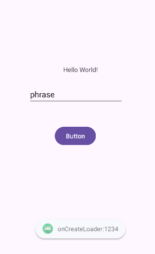
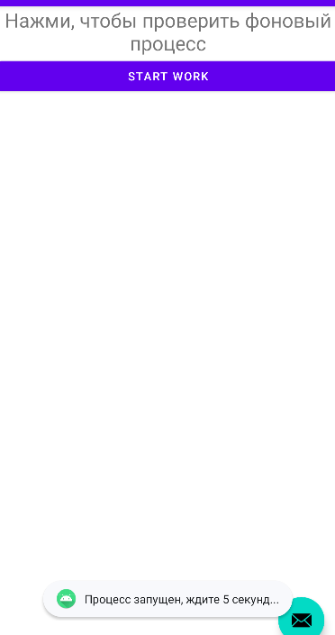

# Отчет по практической работе №4
## Дисциплина: Разработка мобильных приложений

**Выполнил:** Студент группы БСБО-09-23  
**ФИО:** Хречко Роман Викторович  
**Номер по списку:** 25

---

## 1. Цель работы
Изучить технологию привязки представлений `ViewBinding`. Изучить способы реализации
асинхронности в Android: работу с потоками `Thread`, организацию очередей
сообщений `Looper`, `Handler`, использование загрузчиков `CryptoLoader`, создание
фоновых служб `Service` и внедрение планировщика задач `WorkManager`. А также реализовать
изученные технологии в созданный ранее проект `MireaProject`.

---

## 2. Настройка проекта
Для использования **ViewBinding** в файле `build.gradle.kts` была добавлена настройка:

```kotlin
android {
    ...
    buildFeatures {
        viewBinding = true
    }
}
```

---

## 3. Выполнение модулей `Lesson4`

### 3.1 Модуль `thread` (Работа с базовыми потоками)
**Задание:** Выполнить расчет среднего количества пар в отдельном потоке.

**Листинг `MainActivity.java`:**
```Java
    private ActivityMainBinding binding;
    private	int	counter	= 0;

    @Override
    protected void onCreate(Bundle savedInstanceState) {
        super.onCreate(savedInstanceState);

        binding	= ActivityMainBinding.inflate(getLayoutInflater());
        setContentView(binding.getRoot());

        binding.button.setOnClickListener(new	View.OnClickListener()	{
            @Override
            public	void	onClick(View	v)	{
                new	Thread(new	Runnable()	{
                    public	void run()	{
                        int	numberThread	=	counter++;
                        Log.d("ThreadProject", String.format("Запущен поток № %d студентом группы № %s номер по " +
                                "списку № %d ",	numberThread, "БСБО-09-23",	-1));
                        long	endTime	=	System.currentTimeMillis()	+	20	*	1000;
                        while	(System.currentTimeMillis()	<	endTime)	{
                            synchronized	(this)	{
                                try	{
                                    wait(endTime	- System.currentTimeMillis());
                                    Log.d(MainActivity.class.getSimpleName(),	"Endtime: "	+	endTime);
                                }	catch	(Exception	e)	{
                                    throw	new	RuntimeException(e);
                                }
                            }
                            Log.d("ThreadProject",	"Выполнен поток № "	+	numberThread);
                        }
                    }
                }).start();
            }
        });

        Thread mainThread = Thread.currentThread();
        binding.TextView.setText("Имя текущего потока: " + mainThread.getName());
        // Меняем имя и выводим в текстовом поле
        mainThread.setName("МОЙ НОМЕР ГРУППЫ: 09-23, НОМЕР ПО СПИСКУ: 25, МОЙ ЛЮБИИМЫЙ ФИЛЬМ: а я и не знаю");
        binding.TextView.append("\n Новое имя потока: " + mainThread.getName());
        Log.d(MainActivity.class.getSimpleName(),	"Stack:	"	+	Arrays.toString(mainThread.getStackTrace()));

        ViewCompat.setOnApplyWindowInsetsListener(findViewById(R.id.main), (v, insets) -> {
            Insets systemBars = insets.getInsets(WindowInsetsCompat.Type.systemBars());
            v.setPadding(systemBars.left, systemBars.top, systemBars.right, systemBars.bottom);
            return insets;
        });
    }
```

---

### 3.2 Модуль `data_thread` (runOnUiThread, post, postDelayed)
**Задание:** Изучить последовательность выполнения задач в описанном блоке кода.

**Листинг логики переключения текстов:**
```Java
Thread t = new Thread(new Runnable() {
            public void run() {
                try {
                    TimeUnit.SECONDS.sleep(2);
                    runOnUiThread(runn1);            //выполнится через 2 секунды после старта
                    TimeUnit.SECONDS.sleep(1);  
                    textView.postDelayed(runn3, 2000); //выполнится через 2 секунды после runn1 и 1 секунду после runn2
                    textView.post(runn2);  //выполнится через 1 секунды runn1
                } catch (InterruptedException e) {
                    e.printStackTrace();
                }
            }
        });
```
Итоговая последовательность: `runn1` -> `runn2` -> `runn3`.

---

### 3.3 Модуль `looper` (Поток с очередью сообщений)
**Задание:** Создать фоновый поток, обрабатывающий сообщения с задержкой, равной возрасту студента.

**Листинг метода run() класса `MyLooper.java`:**
```Java
    public void run() {
        Log.d("MyLooper", "run");
        Looper.prepare();
        mHandler = new Handler(Looper.myLooper()) {
            public void handleMessage(Message msg) {
                Integer age = msg.getData().getInt("AGE");
                String prof = msg.getData().getString("PROF");

                try {
                    Thread.sleep(age * 1000);
                } catch (InterruptedException e) {
                    throw new RuntimeException(e);
                }

                Message message = new Message();
                Bundle bundle = new Bundle();
                bundle.putString("result", String.format("profession is %s", prof));
                message.setData(bundle);
                //	Send	the	message	back	to	main	thread	message	queue	use	main	thread	message	Handler.
                mainHandler.sendMessage(message);
            }
        };
        Looper.loop();
```

**Листинг класса `MainActivity.java` связанного с handler:**
```Java
        Handler mainThreadHandler = new Handler(Looper.getMainLooper())	{
            @Override
            public void handleMessage(Message msg)	{
                Log.d(MainActivity.class.getSimpleName(), "Task execute. This is result: " + msg.getData().getString("result"));
            }
        };
        MyLooper myLooper = new	MyLooper(mainThreadHandler);
        myLooper.start();

        EditText ageText = findViewById(R.id.editTextAge);
        EditText profText = findViewById(R.id.editTextProfession);
        Button button = findViewById(R.id.button);
        button.setOnClickListener(new View.OnClickListener() {
            @Override
            public void onClick(View v)	{
                Message	msg	= Message.obtain();
                Bundle bundle = new	Bundle();
                bundle.putInt("AGE", Integer.parseInt(ageText.getText().toString()));
                bundle.putString("PROF", profText.getText().toString());
                msg.setData(bundle);
                myLooper.mHandler.sendMessage(msg);
            }
        });
```

---

### 3.4 Модуль `CryptoLoader` (Асинхронная дешифровка)
**Задание:** Реализовать шифрование AES в главном потоке и расшифровку в `Loader`.


**Листинг `MainActivity.java` с шифровкой:**
```Java
public class MainActivity extends AppCompatActivity implements LoaderManager.LoaderCallbacks<String>{

    public final String TAG = this.getClass().getSimpleName();
    private	final int LoaderID = 1234;
    private EditText textInput;

    private SecretKey encryptKey;

    @Override
    protected void onCreate(Bundle savedInstanceState) {
        super.onCreate(savedInstanceState);
        EdgeToEdge.enable(this);
        setContentView(R.layout.activity_main);
        textInput = findViewById(R.id.editTextText);

        encryptKey = generateKey();

        ViewCompat.setOnApplyWindowInsetsListener(findViewById(R.id.main), (v, insets) -> {
            Insets systemBars = insets.getInsets(WindowInsetsCompat.Type.systemBars());
            v.setPadding(systemBars.left, systemBars.top, systemBars.right, systemBars.bottom);
            return insets;
        });
    }

    public static SecretKey generateKey(){
        try	{
            SecureRandom sr	= SecureRandom.getInstance("SHA1PRNG");
            sr.setSeed("any data used as random seed".getBytes());
            KeyGenerator kg	= KeyGenerator.getInstance("AES");
            kg.init(256, sr);
            return new SecretKeySpec((kg.generateKey()).getEncoded(), "AES");
        }	catch (NoSuchAlgorithmException e) {
            throw new RuntimeException(e);
        }
    }

    public	static	byte[]	encryptMsg(String	message,	SecretKey	secret) {
        Cipher cipher = null;
        try {
            cipher = Cipher.getInstance("AES");
            cipher.init(Cipher.ENCRYPT_MODE, secret);
            return cipher.doFinal(message.getBytes());
        } catch (NoSuchAlgorithmException | NoSuchPaddingException | InvalidKeyException |
                 BadPaddingException | IllegalBlockSizeException e) {
            throw new RuntimeException(e);
        }
    }


    public void	onClickButton(View view)	{
        Bundle	bundle	=	new	Bundle();
        bundle.putByteArray(MyLoader.ARG_WORD,	encryptMsg(textInput.getText().toString(), encryptKey));
        bundle.putByteArray("key",	encryptKey.getEncoded());
        LoaderManager.getInstance(this).initLoader(LoaderID,	bundle,	this);
    }
    @Override
    public	void	onLoaderReset(@NonNull	Loader<String>	loader)	{
        Log.d(TAG,	"onLoaderReset");
    }
    @NonNull
    @Override
    public	Loader<String>	onCreateLoader(int	i,	@Nullable	Bundle	bundle)	{
        if	(i	==	LoaderID)	{
            Toast.makeText(this,	"onCreateLoader:"	+	i,	Toast.LENGTH_SHORT).show();
            return	new	MyLoader(this,	bundle);
        }
        throw	new InvalidParameterException("Invalid	loader	id");
    }
    @Override
    public	void	onLoadFinished(@NonNull	Loader<String>	loader,	String	s)	{
        if	(loader.getId()	==	LoaderID)	{
            Log.d(TAG,	"onLoadFinished:	"	+	s);
            Toast.makeText(this,	"onLoadFinished:	"	+	s,	Toast.LENGTH_SHORT).show();
        }
    }
}
```

**Листинг `MyLoader.java` с расшифровкой:**
```Java
public class MyLoader extends AsyncTaskLoader<String> {
    private	String firstName;
    private String returnValue;
    public static final String ARG_WORD = "word";

    public	static	String	decryptMsg(byte[]	cipherText,	SecretKey	secret){
        /*	Decrypt	the	message	*/
        try	{
            Cipher	cipher	=	Cipher.getInstance("AES");
            cipher.init(Cipher.DECRYPT_MODE,	secret);
            return	new	String(cipher.doFinal(cipherText));
        }	catch	(NoSuchAlgorithmException	|	NoSuchPaddingException|	IllegalBlockSizeException
                       |	BadPaddingException	|	InvalidKeyException	e)	{
            throw	new	RuntimeException(e);
        }
    }

    public MyLoader(@NonNull Context context, Bundle args)	{
        super(context);
        if	(args != null) {
            byte[]	cryptText	=	args.getByteArray(ARG_WORD);
            byte[]	key	=	args.getByteArray("key");
            //	Восстановление	ключав
            SecretKey	originalKey	=	new	SecretKeySpec(key, 0, key.length, "AES");
            returnValue = decryptMsg(cryptText, originalKey);
        }
    }

    @Override
    protected void onStartLoading()	{
        super.onStartLoading();
        forceLoad();
    }
    @Override
    public String loadInBackground() {
        //	emulate	long-running	operation
        SystemClock.sleep(5000);
        return returnValue;
    }
}
```

---

### 3.5 Модуль `ServiceApp` (Музыкальный плеер)
**Задание:** Создать PlayerService для проигрывания музыки в фоне.

**Листинг `AndroidManifest.xml` (Разрешения):**
```xml
<uses-permission android:name="android.permission.FOREGROUND_SERVICE"/>
<uses-permission android:name="android.permission.FOREGROUND_SERVICE_MEDIA_PLAYBACK" />
<uses-permission android:name="android.permission.POST_NOTIFICATIONS"/>

<service 
    android:name=".PlayerService"
    android:foregroundServiceType="mediaPlayback" />
```


**Листинг `PlayerService.java` метод onCreate и onStartCommand:**
```Java
    @Override
    public int onStartCommand(Intent intent, int flags, int startId) {
        mediaPlayer.start();
        mediaPlayer.setOnCompletionListener(new MediaPlayer.OnCompletionListener() {
            public void onCompletion(MediaPlayer mp) {
                stopForeground(true);
            }
        });
        return super.onStartCommand(intent, flags, startId);
    }

    @Override
    public void onCreate() {
        super.onCreate();
        NotificationCompat.Builder builder = new NotificationCompat.Builder(this, CHANNEL_ID)
                .setContentText("Playing....")
                .setSmallIcon(R.mipmap.ic_launcher)
                .setPriority(NotificationCompat.PRIORITY_HIGH)
                .setStyle(new NotificationCompat.BigTextStyle()
                        .bigText("Сейчас играет: Zoom by Last Dinosaurs"))
                .setContentTitle("Music	Player");
        int importance = NotificationManager.IMPORTANCE_DEFAULT;
        NotificationChannel channel = new NotificationChannel(CHANNEL_ID, "Student	FIO	Notification", importance);
        channel.setDescription("MIREA	Channel");
        NotificationManagerCompat notificationManager = NotificationManagerCompat.from(this);
        notificationManager.createNotificationChannel(channel);
        startForeground(1, builder.build());
        mediaPlayer = MediaPlayer.create(this, R.raw.music);
        mediaPlayer.setLooping(false);
    }
```

---

### 3.6 Модуль `work_manager` (Гарантированные задачи)
**Задание:** Настроить Worker, который запускается только при наличии интернета и зарядки.

**Листинг `MainActivity.java` с настройкой ограничений на запуск:**
```Java
        Constraints constraints	= new	Constraints.Builder()
                .setRequiredNetworkType(NetworkType.UNMETERED)
                .setRequiresCharging(true)
                .build();
        WorkRequest	uploadWorkRequest =
                new	OneTimeWorkRequest.Builder(UploadWorker.class)
                        .setConstraints(constraints)
                        .build();

        WorkManager.getInstance(this).enqueue(uploadWorkRequest);
```

---

## 4. Дополнительное задание `MireaProject`
**Задание:** Интегрировать фоновую задачу во фрагмент проекта `MireaProject` с помощью
одного из изученных способов.

1. Создан фрагмент `WorkerFragment` с кнопкой запуска.
```Java
        OneTimeWorkRequest toastWorkRequest = new OneTimeWorkRequest.Builder(MyWorker.class)
                .setInitialDelay(5, TimeUnit.SECONDS)
                .build();
        WorkManager.getInstance(requireContext()).enqueue(toastWorkRequest);
        Toast.makeText(requireContext(), "Процесс запущен, ждите 5 секунд...",
                Toast.LENGTH_SHORT).show();
```
2. Реализован `MyWorker.java`, который выполняет ожидание 5 секунд в фоновом режиме, а после отправляет сообщение.
```Java
public class MyWorker extends Worker {
    static final String TAG = "MyWorker";
    public MyWorker(
            @NonNull Context context,
            @NonNull WorkerParameters params) {
        super(context, params);
    }
    @Override
    public Result doWork() {
        try {
            Thread.sleep(5000);

            Handler mainHandler = new Handler(Looper.getMainLooper());
            mainHandler.post(() -> {
                Toast.makeText(getApplicationContext(),
                        "Работа завершена через 5 секунд!",
                        Toast.LENGTH_LONG).show();
            });

            return Result.success();

        } catch (InterruptedException e) {
            e.printStackTrace();
            return Result.failure();
        }
    }
}
```
Добавлена навигация в соответствии с тем что было сделано в 3 практике:
* **`mobile_navigation.xml`**: добавлен фрагмент `nav_worker`.
* **`MainActivity.java`**: ID добавлен в `AppBarConfiguration`.
* **`activity_main_drawer.xml`**: добавлен пункт меню.

---

## 5. Вывод
В ходе работы были изучены такие технологии как `ViewBinding`, способы реализации асинхронности
с помощью `Threads`, `Looper` и `Handler`, `Services`, `WorkManager`, которые могут пригодиться в
различных случаях. В качестве контрольного задания была добавлена дополнительная реализация в проект
`MireaProject` с использованием асинхронности, которая была реализована с помощью `WorkManager`.