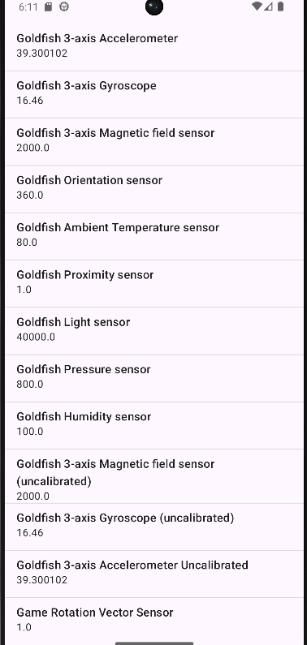
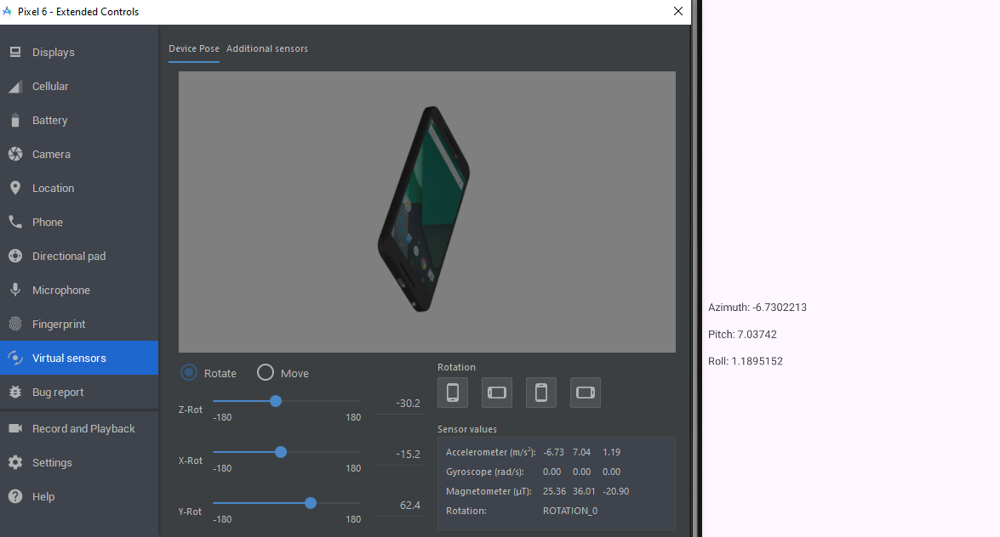
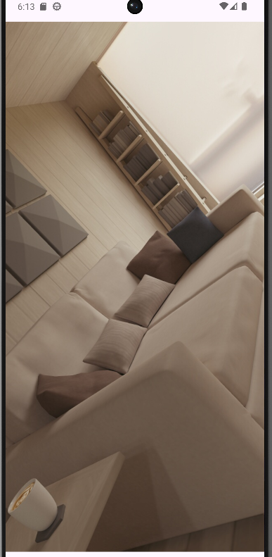
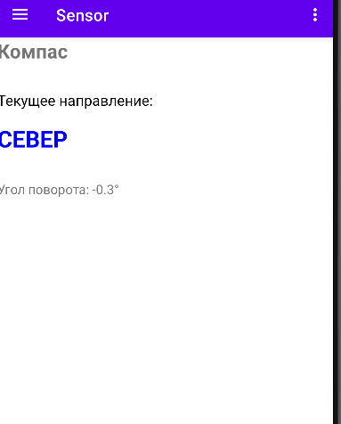

# Отчет по практической работе №5
## Дисциплина: Разработка мобильных приложений

**Выполнил:** Студент группы БСБО-09-23  
**ФИО:** Хречко Роман Викторович  
**Номер по списку:** 25

---

## 1. Цель работы
Изучить возможности работы с различными датчиками. Реализовать запрос разрешений на
различные возможности, которые могут быть использованы для получения информации о
пользователе. Изучить работу с камерой, записью и воспроизведением звука. После этого
реализовать изученные технологии в созданном ранее проекте `MireaProject`.

---

---

## 2. Выполнение модулей `Lesson5`

### 2.1 Модуль `app` Список датчиков
**Задание:** Создать список датчиков, для изучения их работы.



**Листинг `MainActivity.java`:**
```Java
    private ActivityMainBinding binding;
    @Override
    protected void onCreate(Bundle savedInstanceState) {
        super.onCreate(savedInstanceState);
        EdgeToEdge.enable(this);

        binding	= ActivityMainBinding.inflate(getLayoutInflater());
        setContentView(binding.getRoot());
        SensorManager sensorManager	= (SensorManager)getSystemService(Context.SENSOR_SERVICE);
        List<Sensor> sensors = sensorManager.getSensorList(Sensor.TYPE_ALL);
        ListView listSensor	= binding.listView;

        ArrayList<HashMap<String, Object>> arrayList = new	ArrayList<>();
        for	(int i = 0; i < sensors.size();	i++) {
            HashMap<String,	Object> sensorTypeList = new HashMap<>();
            sensorTypeList.put("Name", sensors.get(i).getName());
            sensorTypeList.put("Value", sensors.get(i).getMaximumRange());
            arrayList.add(sensorTypeList);
        }
        SimpleAdapter mHistory =
                new	SimpleAdapter(this,	arrayList, android.R.layout.simple_list_item_2,
                        new	String[]{"Name", "Value"},
                        new	int[]{android.R.id.text1, android.R.id.text2});
        listSensor.setAdapter(mHistory);

        ViewCompat.setOnApplyWindowInsetsListener(findViewById(R.id.main), (v, insets) -> {
            Insets systemBars = insets.getInsets(WindowInsetsCompat.Type.systemBars());
            v.setPadding(systemBars.left, systemBars.top, systemBars.right, systemBars.bottom);
            return insets;
        });
    }
```

---

### 2.2 Модуль `Accelerometer` Акселерометр
**Задание:** Создать акселерометр, для отображения ускорения по 3 осям.

Для реализации класс реализует `SensorEventListener` и его методы `onPause` и `onResume`



**Листинг `MainActivity.java`:**
```Java
    private TextView azimuthTextView;
    private TextView pitchTextView;
    private TextView rollTextView;
    private SensorManager sensorManager;
    private Sensor accelerometerSensor;

    @Override
    protected void onCreate(Bundle savedInstanceState) {
        super.onCreate(savedInstanceState);
        EdgeToEdge.enable(this);
        setContentView(R.layout.activity_main);
        sensorManager = (SensorManager)getSystemService(Context.SENSOR_SERVICE);
        accelerometerSensor = sensorManager.getDefaultSensor(Sensor.TYPE_ACCELEROMETER);
        azimuthTextView = findViewById(R.id.textViewAzimuth);
        pitchTextView = findViewById(R.id.textViewPitch);
        rollTextView = findViewById(R.id.textViewRoll);
        ViewCompat.setOnApplyWindowInsetsListener(findViewById(R.id.main), (v, insets) -> {
            Insets systemBars = insets.getInsets(WindowInsetsCompat.Type.systemBars());
            v.setPadding(systemBars.left, systemBars.top, systemBars.right, systemBars.bottom);
            return insets;
        });
    }

    @Override
    protected void onPause() {
        super.onPause();
        sensorManager.unregisterListener(this);
    }

    @Override
    protected void onResume() {
        super.onResume();
        sensorManager.registerListener(this, accelerometerSensor,
                SensorManager.SENSOR_DELAY_NORMAL);
    }

    @Override
    public void onAccuracyChanged(Sensor sensor, int i) {

    }

    @Override
    public void onSensorChanged(SensorEvent sensorEvent) {
        if (sensorEvent.sensor.getType() == Sensor.TYPE_ACCELEROMETER) {
            float valueAzimuth = sensorEvent.values[0];
            float valuePitch = sensorEvent.values[1];
            float valueRoll = sensorEvent.values[2];
            azimuthTextView.setText("Azimuth: " + valueAzimuth);
            pitchTextView.setText("Pitch: " + valuePitch);
            rollTextView.setText("Roll: " + valueRoll);
        }
    }
```

---

### 2.3 Модуль `Camera` Получение разрешения ни фотографию и хранения
**Задание:** Создать модуль, который позволяет снять фотографию.

Для этого нужно объявить используемые разрешения на камеру в файле `AndroidManifest.xml`, также
в этом файле указывается место хранения файлов фотографий, который был создан по пути `res/xml/paths.xml`.
После этого в классе `MainActivity.java` проверяется разрешения, если их нет, то они запрашиваются у
пользователя. Также создаётся ивент для фотографирования, который также сохраняет созданную фотографию.



**Листинг `AndroidManifest.xml`:**
```xml
<?xml version="1.0" encoding="utf-8"?>
<manifest xmlns:android="http://schemas.android.com/apk/res/android">

    <uses-feature
            android:name="android.hardware.camera"
            android:required="false" />
    <uses-permission android:name="android.permission.CAMERA"/>

    <application
            android:allowBackup="true"
            android:icon="@mipmap/ic_launcher"
            android:label="@string/app_name"
            android:roundIcon="@mipmap/ic_launcher_round"
            android:supportsRtl="true"
            android:theme="@style/Theme.Lesson5">

        <provider
                android:name="androidx.core.content.FileProvider"
                android:authorities="ru.mirea.khrechkorv.camera.fileprovider"
                android:exported="false"
                android:grantUriPermissions="true">
            <meta-data
                    android:name="android.support.FILE_PROVIDER_PATHS"
                    android:resource="@xml/paths"/>
        </provider>

        <activity
                android:name=".MainActivity"
                android:exported="true">
            <intent-filter>
                <action android:name="android.intent.action.MAIN" />

                <category android:name="android.intent.category.LAUNCHER" />
            </intent-filter>
        </activity>
    </application>

</manifest>
```

**Листинг класса `MainActivity.java`:**
```Java
            private static final int REQUEST_CODE_PERMISSION = 100;
    private	boolean	isWork = false;
    private Uri imageUri;
    private ActivityMainBinding binding;

    @Override
    protected void onCreate(Bundle savedInstanceState) {
        super.onCreate(savedInstanceState);
        EdgeToEdge.enable(this);
        binding	= ActivityMainBinding.inflate(getLayoutInflater());
        setContentView(binding.getRoot());

        int	cameraPermissionStatus	= ContextCompat.checkSelfPermission(this,	android.Manifest.permission.CAMERA);
        int	storagePermissionStatus	= ContextCompat.checkSelfPermission(this,	android.Manifest.permission.WRITE_EXTERNAL_STORAGE);
        if (cameraPermissionStatus == PackageManager.PERMISSION_GRANTED && storagePermissionStatus == PackageManager.PERMISSION_GRANTED) {
            isWork = true;
        } else {
            ActivityCompat.requestPermissions(this, new String[]{android.Manifest.permission.CAMERA,
                    Manifest.permission.WRITE_EXTERNAL_STORAGE}, REQUEST_CODE_PERMISSION);
        }


        ActivityResultCallback<ActivityResult> callback	= new ActivityResultCallback<ActivityResult>() {
            @Override
            public void onActivityResult(ActivityResult	result)	{
                if (result.getResultCode() == Activity.RESULT_OK) {
                    Intent data	= result.getData();
                    binding.imageView.setImageURI(imageUri);
                }
            }
        };


        ActivityResultLauncher<Intent> cameraActivityResultLauncher	= registerForActivityResult(
                new	ActivityResultContracts.StartActivityForResult(),
                callback);
        binding.imageView.setOnClickListener(
                new	View.OnClickListener() {
                    @Override
                    public void onClick(View v) {
                        Intent cameraIntent = new Intent(MediaStore.ACTION_IMAGE_CAPTURE);
                        if (isWork) {
                            try {
                                File photoFile = createImageFile();
                                String authorities = getApplicationContext().getPackageName() + ".fileprovider";
                                imageUri = FileProvider.getUriForFile(MainActivity.this, authorities, photoFile);
                                cameraIntent.putExtra(MediaStore.EXTRA_OUTPUT, imageUri);
                                cameraActivityResultLauncher.launch(cameraIntent);
                            } catch (IOException e) {
                                e.printStackTrace();
                            }
                        }
                    }
                });


        ViewCompat.setOnApplyWindowInsetsListener(findViewById(R.id.main), (v, insets) -> {
            Insets systemBars = insets.getInsets(WindowInsetsCompat.Type.systemBars());
            v.setPadding(systemBars.left, systemBars.top, systemBars.right, systemBars.bottom);
            return insets;
        });
    }

    @Override
    public	void onRequestPermissionsResult(int	requestCode, @NonNull String[] permissions, @NonNull int[] grantResults) {
        super.onRequestPermissionsResult(requestCode, permissions, grantResults);
        if (requestCode == REQUEST_CODE_PERMISSION) {
            isWork = grantResults.length > 0
                    && grantResults[0] == PackageManager.PERMISSION_GRANTED;
        }
    }

    private	File createImageFile() throws IOException {
        String timeStamp = new SimpleDateFormat("yyyyMMdd_HHmmss", Locale.ENGLISH).format(new Date());
        String imageFileName = "IMAGE_"	+ timeStamp + "_";
        File storageDirectory = getExternalFilesDir(Environment.DIRECTORY_PICTURES);
        return File.createTempFile(imageFileName, ".jpg", storageDirectory);
    }
```

---

### 2.4 Модуль `AudioRecord` Запись и прослушивание
**Задание:** Реализовать запись звука с микрофона, после чего можно прослушать созданную запись.

В данном случае также нужны разрешения, которые указываются в файле `AndroidManifest.xml`. В этом классе
используется те же части кода, как и в прошлом связанные с получением разрешений. Для реализации записи и
воспроизведения основными методами являются: `startRecording`, `stopRecording`, `startPlaying`, `stopPlaying` и
методы, для реализации функционала кнопок, которые объявляются в методе `onCreate`.

**Листинг `MainActivity.java`:**
```Java
private static final int REQUEST_CODE_PERMISSION = 200;
    private boolean isWork;
    private ActivityMainBinding binding;
    private final String TAG = MainActivity.class.getSimpleName();
    private String fileName = null;
    private Button recordButton = null;
    private Button playButton = null;
    private MediaRecorder recorder = null;
    private MediaPlayer player = null;
    boolean isStartRecording = true;
    boolean isStartPlaying = true;
    String recordFilePath = null;

    @Override
    protected void onCreate(Bundle savedInstanceState) {
        super.onCreate(savedInstanceState);
        EdgeToEdge.enable(this);

        binding = ActivityMainBinding.inflate(getLayoutInflater());
        setContentView(binding.getRoot());
        // инициализация кнопок записи и воспроизведения
        recordButton = binding.recordButton;
        playButton = binding.playButton;
        playButton.setEnabled(false);
        recordFilePath = (new File(getExternalFilesDir(Environment.DIRECTORY_MUSIC),
                "/audiorecordtest.3gp")).getAbsolutePath();

        // разрешения
        int audioRecordPermissionStatus = ContextCompat.checkSelfPermission(this,
                Manifest.permission.RECORD_AUDIO);
        int storagePermissionStatus = ContextCompat.checkSelfPermission(this, android.Manifest.permission.
                WRITE_EXTERNAL_STORAGE);
        if (audioRecordPermissionStatus == PackageManager.PERMISSION_GRANTED && storagePermissionStatus
                == PackageManager.PERMISSION_GRANTED) {
            isWork = true;
        } else {
            ActivityCompat.requestPermissions(this, new String[]{Manifest.permission.RECORD_AUDIO,
                    android.Manifest.permission.WRITE_EXTERNAL_STORAGE}, REQUEST_CODE_PERMISSION);
        }

        recordButton.setOnClickListener(new View.OnClickListener() {
            @Override
            public void onClick(View v) {
                if (isStartRecording) {
                    recordButton.setText("Stop recording");
                    playButton.setEnabled(false);
                    startRecording();
                } else {
                    recordButton.setText("Start recording");
                    playButton.setEnabled(true);
                    stopRecording();
                }
                isStartRecording = !isStartRecording;
            }
        });

        playButton.setOnClickListener(new View.OnClickListener() {
            @Override
            public void onClick(View v) {
                if (isStartPlaying) {
                    playButton.setText("Stop playing");
                    recordButton.setEnabled(false);
                    startPlaying();
                } else {
                    playButton.setText("Start playing");
                    recordButton.setEnabled(false);
                    stopPlaying();
                }
                isStartPlaying = !isStartPlaying;
            }
        });


        ViewCompat.setOnApplyWindowInsetsListener(findViewById(R.id.main), (v, insets) -> {
            Insets systemBars = insets.getInsets(WindowInsetsCompat.Type.systemBars());
            v.setPadding(systemBars.left, systemBars.top, systemBars.right, systemBars.bottom);
            return insets;
        });
    }

    @Override
    public void onRequestPermissionsResult(int requestCode, @NonNull String[] permissions, @NonNull int[]
            grantResults) {
        super.onRequestPermissionsResult(requestCode, permissions, grantResults);
        if (requestCode == REQUEST_CODE_PERMISSION) {
                isWork = grantResults[0] == PackageManager.PERMISSION_GRANTED;
        }
        if (!isWork) finish();
    }

    private	void startRecording() {
        recorder = new MediaRecorder();
        recorder.setAudioSource(MediaRecorder.AudioSource.MIC);
        recorder.setOutputFormat(MediaRecorder.OutputFormat.THREE_GPP);
        recorder.setOutputFile(recordFilePath);
        recorder.setAudioEncoder(MediaRecorder.AudioEncoder.AMR_NB);
        try {
            recorder.prepare();
        } catch (IOException e) {
            Log.e(TAG, "prepare() failed");
        }
        recorder.start();
    }

    private	void stopRecording() {
        recorder.stop();
        recorder.release();
        recorder = null;
    }

    private	void startPlaying() {
        player = new MediaPlayer();
        try {
            player.setDataSource(recordFilePath);
            player.prepare();
            player.start();
        } catch (IOException e) {
            Log.e(TAG, "prepare() failed");
        }
    }

    private	void stopPlaying() {
        player.release();
        player = null;
    }
```

---

## 3. Дополнительное задание `MireaProject`
**Задание:** Реализовать изученные возможности в проекте `MireaProject` и создать 3 различных фрагмента
для датчика, камеры и микрофона.

Для каждого фрагмента были настроены значения для корректной работы в проекте и навигации по списку всех фрагментов.

### 3.1. Создан фрагмент `SensorFragment` с датчиком направления
Фрагмент позволяет увидеть угол как в компасе, а также сторону света.



**Листинг `SensorFragment.java`:**
```Java
package ru.mirea.khrechkorv.mireaproject.ui;

import android.content.Context;
import android.graphics.Color;
import android.hardware.Sensor;
import android.hardware.SensorEvent;
import android.hardware.SensorEventListener;
import android.hardware.SensorManager;
import android.os.Bundle;
import android.view.LayoutInflater;
import android.view.View;
import android.view.ViewGroup;
import android.widget.TextView;

import androidx.annotation.NonNull;
import androidx.annotation.Nullable;
import androidx.fragment.app.Fragment;

import java.util.Locale;

import ru.mirea.khrechkorv.mireaproject.R;

public class SensorFragment extends Fragment implements SensorEventListener {
    private SensorManager sensorManager;
    private Sensor orientationSensor;
    private TextView tvDirectionValue;
    private TextView tvDirectionStatus;
    private TextView tvDegreesValue;

    @Nullable
    @Override
    public View onCreateView(@NonNull LayoutInflater inflater, @Nullable ViewGroup container, @Nullable Bundle savedInstanceState) {
        View root = inflater.inflate(R.layout.fragment_sensor, container, false);

        tvDirectionValue = root.findViewById(R.id.tvDirectionValue);
        tvDirectionStatus = root.findViewById(R.id.tvDirectionStatus);
        tvDegreesValue = root.findViewById(R.id.tvDegreesValue);

        sensorManager = (SensorManager) requireContext().getSystemService(Context.SENSOR_SERVICE);
        orientationSensor = sensorManager.getDefaultSensor(Sensor.TYPE_ORIENTATION);

        if (orientationSensor == null) {
            tvDirectionStatus.setText("Сенсор ориентации не доступен");
            tvDirectionStatus.setTextColor(Color.RED);
        }

        return root;
    }

    @Override
    public void onSensorChanged(SensorEvent event) {
        if (event.sensor.getType() == Sensor.TYPE_ORIENTATION) {
            float azimuth = event.values[0];

            tvDegreesValue.setText(String.format(Locale.getDefault(), "Угол поворота: %.1f°", azimuth));

            String direction = getDirection(azimuth);
            int color = getColorForDirection(direction);

            tvDirectionValue.setText(direction);
            tvDirectionValue.setTextColor(color);
            tvDirectionStatus.setText("Текущее направление:");
            tvDirectionStatus.setTextColor(Color.BLACK);
        }
    }

    private String getDirection(float azimuth) {
        if (azimuth >= 337.5f || azimuth < 22.5f) {
            return "СЕВЕР";
        } else if (azimuth >= 22.5f && azimuth < 67.5f) {
            return "СЕВЕРО-ВОСТОК";
        } else if (azimuth >= 67.5f && azimuth < 112.5f) {
            return "ВОСТОК";
        } else if (azimuth >= 112.5f && azimuth < 157.5f) {
            return "ЮГО-ВОСТОК";
        } else if (azimuth >= 157.5f && azimuth < 202.5f) {
            return "ЮГ";
        } else if (azimuth >= 202.5f && azimuth < 247.5f) {
            return "ЮГО-ЗАПАД";
        } else if (azimuth >= 247.5f && azimuth < 292.5f) {
            return "ЗАПАД";
        } else if (azimuth >= 292.5f && azimuth < 337.5f) {
            return "СЕВЕРО-ЗАПАД";
        }
        return "НЕИЗВЕСТНО";
    }

    private int getColorForDirection(String direction) {
        switch (direction) {
            case "СЕВЕР":
                return Color.BLUE;
            case "ЮГ":
                return Color.RED;
            case "ВОСТОК":
                return Color.parseColor("#FFA500");
            case "ЗАПАД":
                return Color.parseColor("#800080");
            case "СЕВЕРО-ВОСТОК":
                return Color.parseColor("#00BFFF");
            case "СЕВЕРО-ЗАПАД":
                return Color.parseColor("#00CED1");
            case "ЮГО-ВОСТОК":
                return Color.parseColor("#FF8C00");
            case "ЮГО-ЗАПАД":
                return Color.parseColor("#FF69B4");
            default:
                return Color.GRAY;
        }
    }

    @Override
    public void onAccuracyChanged(Sensor sensor, int accuracy) {}

    @Override
    public void onResume() {
        super.onResume();
        if (orientationSensor != null) {
            sensorManager.registerListener(this, orientationSensor, SensorManager.SENSOR_DELAY_UI);
        }
    }

    @Override
    public void onPause() {
        super.onPause();
        if (sensorManager != null) {
            sensorManager.unregisterListener(this);
        }
    }
}

```
### 3.2. `CameraFragment` для создания фотографии и подписи

Пользователь может сделать фотографию и подписать её. Когда будет сделана следующая фотография прошлая
подпись пропадёт автоматически.


**Листинг `CameraFragment.java`:**
```Java
package ru.mirea.khrechkorv.mireaproject.ui;

import android.Manifest;
import android.app.Activity;
import android.content.Intent;
import android.content.pm.PackageManager;
import android.net.Uri;
import android.os.Bundle;
import android.os.Environment;
import android.provider.MediaStore;
import android.view.LayoutInflater;
import android.view.View;
import android.view.ViewGroup;
import android.widget.EditText;
import android.widget.ImageView;
import android.widget.Toast;

import androidx.activity.result.ActivityResultLauncher;
import androidx.activity.result.contract.ActivityResultContracts;
import androidx.annotation.NonNull;
import androidx.annotation.Nullable;
import androidx.core.content.ContextCompat;
import androidx.core.content.FileProvider;
import androidx.fragment.app.Fragment;


import java.io.File;
import java.io.IOException;
import java.text.SimpleDateFormat;
import java.util.Date;
import java.util.Locale;

import ru.mirea.khrechkorv.mireaproject.R;

public class CameraFragment extends Fragment {

    private static final int REQUEST_CODE_PERMISSION = 100;
    private Uri imageUri;
    private ImageView image;
    private EditText editText;
    private	boolean	isWork = false;

    private final ActivityResultLauncher<String> requestPermissionLauncher =
            registerForActivityResult(new ActivityResultContracts.RequestPermission(), isGranted -> {
                if (isGranted) {
                    openCamera();
                } else {
                    Toast.makeText(getContext(), "Camera permission is required", Toast.LENGTH_SHORT).show();
                }
            });

    private final ActivityResultLauncher<Intent> takePictureLauncher =
            registerForActivityResult(new ActivityResultContracts.StartActivityForResult(), result -> {
                if (result.getResultCode() == Activity.RESULT_OK) {
                    Intent data	= result.getData();
                    image.setImageURI(imageUri);
                    ClearText();
                }
            });


    @Override
    public View onCreateView(@NonNull LayoutInflater inflater, @Nullable ViewGroup container, @Nullable Bundle savedInstanceState) {
        View root = inflater.inflate(R.layout.fragment_camera, container, false);
        super.onCreate(savedInstanceState);
        image = root.findViewById(R.id.imageView);
        editText = root.findViewById(R.id.editTextText2);
        image.setOnClickListener(view ->  openCamera());

        checkPermission();
        return  root;
    }


    private void checkPermission() {
        if (ContextCompat.checkSelfPermission(requireContext(), Manifest.permission.CAMERA) == PackageManager.PERMISSION_GRANTED) {
            openCamera();
            isWork = true;
        } else {
            requestPermissionLauncher.launch(Manifest.permission.CAMERA);
            isWork = false;
        }
    }

    private void openCamera() {
        Intent cameraIntent = new Intent(MediaStore.ACTION_IMAGE_CAPTURE);
        if (isWork) {
            File photoFile = null;
            try {
                photoFile = createImageFile();
            } catch (IOException e) {
                e.printStackTrace();
            }
            if (photoFile != null) {
                imageUri = FileProvider.getUriForFile(requireContext(),
                        "ru.mirea.khrechkorv.mireaproject.fileprovider",
                        photoFile);
                cameraIntent.putExtra(MediaStore.EXTRA_OUTPUT, imageUri);
                takePictureLauncher.launch(cameraIntent);
            }
        }
    }

    private	File createImageFile() throws IOException {
        String timeStamp = new SimpleDateFormat("yyyyMMdd_HHmmss", Locale.ENGLISH).format(new Date());
        String imageFileName = "IMAGE_"	+ timeStamp + "_";
        File storageDirectory = requireContext().getExternalFilesDir(Environment.DIRECTORY_PICTURES);
        return File.createTempFile(imageFileName, ".jpg", storageDirectory);
    }

    private void ClearText(){
        editText.setText("");
    }
}

```
### 3.3. `RecorderFragment` Запись, прослушивание и удаление аудиофайла

Пользователь может создать аудио заметку, которые после этого может прослушать. Во время записи можно остановить запись.
После создания запись сохраняется для прослушивания. Есть возможность удалить существующую запись либо начать запись, что
также удалит сохранённую запись.

**Листинг `RecorderFragment.java`:**
```Java
package ru.mirea.khrechkorv.mireaproject.ui;

import android.Manifest;
import android.content.pm.PackageManager;
import android.media.MediaPlayer;
import android.media.MediaRecorder;
import android.os.Bundle;
import android.os.Environment;
import android.util.Log;
import android.view.LayoutInflater;
import android.view.View;
import android.view.ViewGroup;
import android.widget.Button;
import android.widget.TextView;
import android.widget.Toast;

import androidx.annotation.NonNull;
import androidx.annotation.Nullable;
import androidx.core.app.ActivityCompat;
import androidx.core.content.ContextCompat;
import androidx.fragment.app.Fragment;

import java.io.File;
import java.io.IOException;

import ru.mirea.khrechkorv.mireaproject.R;

public class RecorderFragment extends Fragment {
    private static final int REQUEST_RECORD_AUDIO_PERMISSION = 200;
    private Button btnRecord, btnPlay, btnDelete;
    private TextView tvRecordingStatus;
    private MediaRecorder recorder = null;
    private MediaPlayer player = null;
    private boolean isRecording = false;
    private boolean isPlaying = false;
    private String recordFilePath = null;
    private File audioFile;
    private String[] permissions = {Manifest.permission.RECORD_AUDIO};

    @Nullable
    @Override
    public View onCreateView(@NonNull LayoutInflater inflater, @Nullable ViewGroup container, @Nullable Bundle savedInstanceState) {
        View root = inflater.inflate(R.layout.fragment_recorder, container, false);

        btnRecord = root.findViewById(R.id.btnRecord);
        btnPlay = root.findViewById(R.id.btnPlay);
        btnDelete = root.findViewById(R.id.btnDelete);
        tvRecordingStatus = root.findViewById(R.id.tvRecordingStatus);

        setupAudioFilePath();

        btnRecord.setOnClickListener(view -> handleRecordButtonClick());
        btnPlay.setOnClickListener(view -> handlePlayButtonClick());
        btnDelete.setOnClickListener(view -> deleteAudio());

        checkExistingRecording();

        return root;
    }

    private void setupAudioFilePath() {
        File musicDir = requireContext().getExternalFilesDir(Environment.DIRECTORY_MUSIC);
        if (musicDir != null) {
            if (!musicDir.exists()) {
                musicDir.mkdirs();
            }
            audioFile = new File(musicDir, "my_recording.3gp");
            recordFilePath = audioFile.getAbsolutePath();
            Log.d("RecorderFragment", "Recording file path: " + recordFilePath);
        }
    }

    private void checkExistingRecording() {
        if (audioFile != null && audioFile.exists()) {
            btnPlay.setVisibility(View.VISIBLE);
            btnDelete.setVisibility(View.VISIBLE);
        } else {
            btnPlay.setVisibility(View.GONE);
            btnDelete.setVisibility(View.GONE);
        }
    }

    private void handleRecordButtonClick() {
        if (ContextCompat.checkSelfPermission(requireContext(), Manifest.permission.RECORD_AUDIO)
                != PackageManager.PERMISSION_GRANTED) {
            ActivityCompat.requestPermissions(requireActivity(), permissions, REQUEST_RECORD_AUDIO_PERMISSION);
        } else {
            if (isRecording) {
                stopRecording();
            } else {
                startRecording();
            }
        }
    }

    private void handlePlayButtonClick() {
        if (isPlaying) {
            stopPlaying();
        } else {
            startPlaying();
        }
    }

    private void startRecording() {
        if (recordFilePath == null) {
            Toast.makeText(getContext(), "Ошибка: путь для сохранения не найден", Toast.LENGTH_SHORT).show();
            return;
        }

        if (isPlaying) {
            stopPlaying();
        }

        if (audioFile.exists()) {
            boolean deleted = audioFile.delete();
            Log.d("RecorderFragment", "Old recording deleted: " + deleted);
        }

        recorder = new MediaRecorder();
        recorder.setAudioSource(MediaRecorder.AudioSource.MIC);
        recorder.setOutputFormat(MediaRecorder.OutputFormat.THREE_GPP);
        recorder.setOutputFile(recordFilePath);
        recorder.setAudioEncoder(MediaRecorder.AudioEncoder.AMR_NB);

        try {
            recorder.prepare();
            recorder.start();
            isRecording = true;

            // Обновляем UI
            btnRecord.setText("Остановить запись");
            btnPlay.setVisibility(View.GONE);
            btnDelete.setVisibility(View.GONE);
            tvRecordingStatus.setVisibility(View.VISIBLE);
            tvRecordingStatus.setText("Идет запись...");

            Toast.makeText(getContext(), "Запись начата", Toast.LENGTH_SHORT).show();

        } catch (IOException e) {
            Log.e("RecorderFragment", "Ошибка при подготовке записи: " + e.getMessage());
            Toast.makeText(getContext(), "Ошибка при начале записи", Toast.LENGTH_SHORT).show();
            if (recorder != null) {
                recorder.release();
                recorder = null;
            }
        }
    }

    private void stopRecording() {
        if (recorder != null) {
            try {
                recorder.stop();
                recorder.release();
                recorder = null;
                isRecording = false;

                Toast.makeText(getContext(), "Запись сохранена", Toast.LENGTH_SHORT).show();

                btnRecord.setText("Начать запись");
                btnPlay.setVisibility(View.VISIBLE);
                btnDelete.setVisibility(View.VISIBLE);
                tvRecordingStatus.setVisibility(View.GONE);

            } catch (RuntimeException e) {
                Log.e("RecorderFragment", "Ошибка при остановке записи: " + e.getMessage());
                Toast.makeText(getContext(), "Ошибка при остановке записи", Toast.LENGTH_SHORT).show();

                if (audioFile.exists()) {
                    audioFile.delete();
                }
            }
        }
    }

    private void startPlaying() {
        if (recordFilePath == null || !audioFile.exists()) {
            Toast.makeText(getContext(), "Файл не найден", Toast.LENGTH_SHORT).show();
            return;
        }

        stopPlaying();

        player = new MediaPlayer();
        try {
            player.setDataSource(recordFilePath);
            player.prepare();
            player.start();
            isPlaying = true;
            btnPlay.setText("Пауза");

            player.setOnCompletionListener(mp -> {
                stopPlaying();
                Toast.makeText(getContext(), "Воспроизведение завершено", Toast.LENGTH_SHORT).show();
            });

            player.setOnErrorListener((mp, what, extra) -> {
                Toast.makeText(getContext(), "Ошибка воспроизведения", Toast.LENGTH_SHORT).show();
                stopPlaying();
                return true;
            });

        } catch (IOException e) {
            Log.e("RecorderFragment", "Ошибка при воспроизведении: " + e.getMessage());
            Toast.makeText(getContext(), "Ошибка при воспроизведении", Toast.LENGTH_SHORT).show();
            stopPlaying();
        }
    }

    private void stopPlaying() {
        if (player != null) {
            if (player.isPlaying()) {
                player.stop();
            }
            player.release();
            player = null;
        }
        isPlaying = false;
        btnPlay.setText("Воспроизвести");
    }

    private void deleteAudio() {
        if (audioFile != null && audioFile.exists()) {
            if (isPlaying) {
                stopPlaying();
            }

            if (audioFile.delete()) {
                Toast.makeText(getContext(), "Аудио удалено", Toast.LENGTH_SHORT).show();
                btnPlay.setVisibility(View.GONE);
                btnDelete.setVisibility(View.GONE);
            } else {
                Toast.makeText(getContext(), "Ошибка при удалении файла", Toast.LENGTH_SHORT).show();
            }
        } else {
            Toast.makeText(getContext(), "Файл не существует", Toast.LENGTH_SHORT).show();
        }
    }

    @Override
    public void onRequestPermissionsResult(int requestCode, @NonNull String[] permissions,
                                           @NonNull int[] grantResults) {
        super.onRequestPermissionsResult(requestCode, permissions, grantResults);
        if (requestCode == REQUEST_RECORD_AUDIO_PERMISSION) {
            if (grantResults.length > 0 && grantResults[0] == PackageManager.PERMISSION_GRANTED) {
                Toast.makeText(getContext(), "Разрешение получено", Toast.LENGTH_SHORT).show();
            } else {
                Toast.makeText(getContext(), "Разрешение на запись аудио необходимо", Toast.LENGTH_LONG).show();
            }
        }
    }

    @Override
    public void onStop() {
        super.onStop();
        if (recorder != null) {
            try {
                if (isRecording) {
                    recorder.stop();
                }
                recorder.release();
            } catch (Exception e) {
                Log.e("RecorderFragment", "Ошибка при освобождении рекордера: " + e.getMessage());
            }
            recorder = null;
        }
        if (player != null) {
            player.release();
            player = null;
        }
    }
}

```

---

## 4. Вывод
В ходе работы были изучены возможности различных датчиков, в частности акселерометра. Также для
защиты личной информации пользователя были использованы разрешения на снятие фотографий и запись звука.
После этого изученные возможности были реализованы в проекте `MireaProject` для создания 3 фрагментов, которые
включают в себя все изученные инструменты.