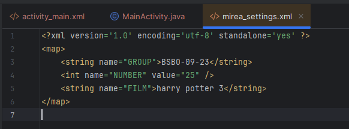
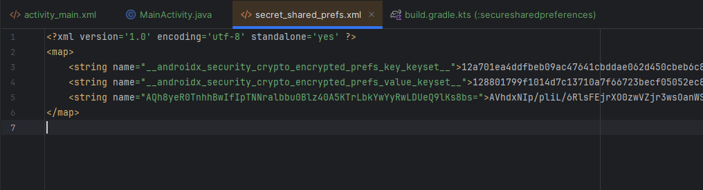
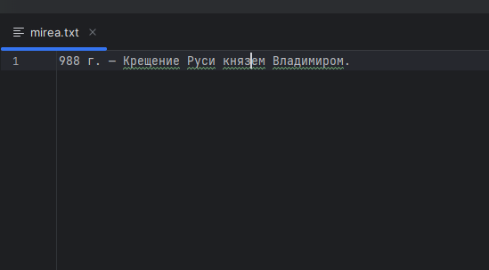
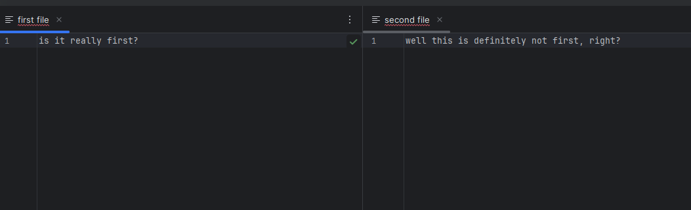
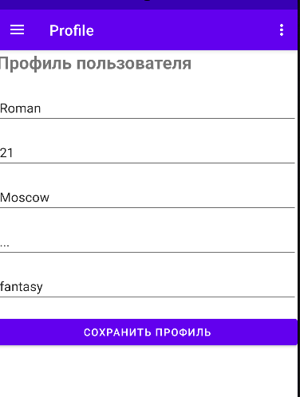
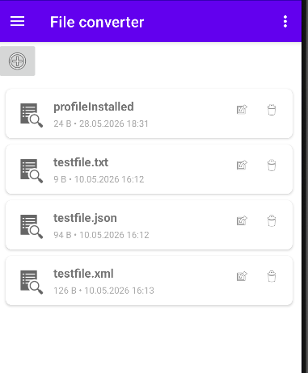

# Отчет по практической работе №6
## Дисциплина: Разработка мобильных приложений

**Выполнил:** Студент группы БСБО-09-23  
**ФИО:** Хречко Роман Викторович  
**Номер по списку:** 25

---

## 1. Цель работы
Изучить возможности Android для сохранения информации с помощью `SharedPreferences`,
а также шифрование с помощью `EncryptedSharedPreferences`. Возможности работы с
sql хранилищем. После этого реализовать изученные технологии в созданном ранее проекте `MireaProject`.

---

## 2. Выполнение модулей `Lesson6`

### 2.1 Модуль `app` сохранение данных в `SharedPreferences`
**Задание:** Создать экран с вводом значений, которые должны сохраняться после полного перезапуска приложения.

Изображение о сохранении находится в папке `app/res/raw`



**Листинг `MainActivity.java`:**
```Java
    public class MainActivity extends AppCompatActivity {

    private ActivityMainBinding binding;
    private Button buttonSave = null;

    @Override
    protected void onCreate(Bundle savedInstanceState) {
        super.onCreate(savedInstanceState);
        EdgeToEdge.enable(this);
        binding = ActivityMainBinding.inflate(getLayoutInflater());
        setContentView(binding.getRoot());
        buttonSave = binding.buttonSave;
        SharedPreferences sharedPref = getSharedPreferences("mirea_settings", Context.MODE_PRIVATE);
        SharedPreferences.Editor editor = sharedPref.edit();

        binding.editTextGroup.setText(sharedPref.getString("GROUP", ""));
        binding.editTextNumber.setText(Integer.toString(sharedPref.getInt("NUMBER", 0)));
        binding.editTextFavorite.setText(sharedPref.getString("FILM", ""));

        buttonSave.setOnClickListener(new View.OnClickListener() {
            @Override
            public void onClick(View v) {
                editor.putString("GROUP", binding.editTextGroup.getText().toString());
                editor.putInt("NUMBER", Integer.parseInt(binding.editTextNumber.getText().toString()));
                editor.putString("FILM", binding.editTextFavorite.getText().toString());
                editor.apply();
            }
        });
        ViewCompat.setOnApplyWindowInsetsListener(findViewById(R.id.main), (v, insets) -> {
            Insets systemBars = insets.getInsets(WindowInsetsCompat.Type.systemBars());
            v.setPadding(systemBars.left, systemBars.top, systemBars.right, systemBars.bottom);
            return insets;
        });
    }
}
```

---

### 2.2 Модуль `securesharedpreferences` шифрование данных в `EncryptedSharedPreferences`
**Задание:** Создать экран с вводом имени любимого поэта, а после чего эту информацию нужно зашифровать.

Изображение о сохранении находится в папке `app/res/raw`



**Листинг `MainActivity.java`:**
```Java
public class MainActivity extends AppCompatActivity {

    @Override
    protected void onCreate(Bundle savedInstanceState) {
        super.onCreate(savedInstanceState);
        EdgeToEdge.enable(this);
        setContentView(R.layout.activity_main);

        Button buttonSave = findViewById(R.id.button);
        TextView text = findViewById(R.id.editTextText);

        buttonSave.setOnClickListener(new View.OnClickListener() {
            @Override
            public void onClick(View v) {
                try {
                    KeyGenParameterSpec keyGenParameterSpec = MasterKeys.AES256_GCM_SPEC;
                    String mainKeyAlias = MasterKeys.getOrCreate(keyGenParameterSpec);
                    SharedPreferences secureSharedPreferences = EncryptedSharedPreferences.create(
                            "secret_shared_prefs",
                            mainKeyAlias,
                            MainActivity.this,
                            EncryptedSharedPreferences.PrefKeyEncryptionScheme.AES256_SIV,
                            EncryptedSharedPreferences.PrefValueEncryptionScheme.AES256_GCM
                    );
                    secureSharedPreferences.edit().putString("ЛЮБИМЫЙ ПОЭТ", text.getText().toString()).apply();
                } catch (GeneralSecurityException | IOException e) {
                    throw new RuntimeException(e);
                }
            }
        });

        ViewCompat.setOnApplyWindowInsetsListener(findViewById(R.id.main), (v, insets) -> {
            Insets systemBars = insets.getInsets(WindowInsetsCompat.Type.systemBars());
            v.setPadding(systemBars.left, systemBars.top, systemBars.right, systemBars.bottom);
            return insets;
        });
    }
}
```

---

### 2.3 Модуль `internalfilestorage` внутреннее хранилище файлов
**Задание:** Сохранить текст о важной дате в истории России в отдельный файл

Файл о сохранении находится в папке `app/res/raw`



**Листинг класса `MainActivity.java`:**
```Java
public class MainActivity extends AppCompatActivity {

    private static final String LOG_TAG = MainActivity.class.getSimpleName();
    private String fileName = "mirea.txt";
    private TextView tv;
    private EditText te;
    private Button btn;

    @Override
    protected void onCreate(Bundle savedInstanceState) {
        super.onCreate(savedInstanceState);
        EdgeToEdge.enable(this);
        setContentView(R.layout.activity_main);


        tv = findViewById(R.id.textView);
        te = findViewById(R.id.editText);
        btn = findViewById(R.id.button);

        btn.setOnClickListener(new View.OnClickListener() {
            @Override
            public void onClick(View v) {
                try {
                    FileOutputStream outputStream;
                    outputStream = openFileOutput(fileName, Context.MODE_PRIVATE);
                    outputStream.write(te.getText().toString().getBytes());
                    outputStream.close();
                } catch (Exception e) {
                    e.printStackTrace();
                }

                new Thread(new Runnable() {
                    public void run() {
                        try {
                            Thread.sleep(3000);
                        } catch (InterruptedException e) {
                            e.printStackTrace();
                        }
                        tv.post(new Runnable() {
                            public void run() {
                                tv.setText(getTextFromFile());
                            }
                        });
                    }
                }).start();
            }
        });


        ViewCompat.setOnApplyWindowInsetsListener(findViewById(R.id.main), (v, insets) -> {
            Insets systemBars = insets.getInsets(WindowInsetsCompat.Type.systemBars());
            v.setPadding(systemBars.left, systemBars.top, systemBars.right, systemBars.bottom);
            return insets;
        });
    }

    public String getTextFromFile() {
        FileInputStream fin = null;
        try {
            fin = openFileInput(fileName);
            byte[] bytes = new byte[fin.available()];
            fin.read(bytes);
            String text = new String(bytes);
            Log.d(LOG_TAG, text);
            return text;
        } catch (IOException ex) {
            Toast.makeText(this, ex.getMessage(), Toast.LENGTH_SHORT).show();
        } finally {
            try {
                if (fin != null)
                    fin.close();
            } catch (IOException ex) {
                Toast.makeText(this, ex.getMessage(), Toast.LENGTH_SHORT).show();
            }
        }
        return null;
    }
}
```

---

### 2.4 Модуль `notebook` внешнее хранилище приложения
**Задание:** Создать приложение для создания цитат, которые должны записываться в отдельные файлы.

Файлы о сохранении находится в папке `app/res/raw`



**Листинг `MainActivity.java`:**
```Java
public class MainActivity extends AppCompatActivity {

    private static final String TAG = "MainActivity";
    private static final int REQUEST_CODE_PERMISSION = 100;

    private EditText editTextFileName;
    private EditText editTextQuote;
    private Button buttonSave;
    private Button buttonLoad;

    @Override
    protected void onCreate(Bundle savedInstanceState) {
        super.onCreate(savedInstanceState);
        EdgeToEdge.enable(this);
        setContentView(R.layout.activity_main);

        editTextFileName = findViewById(R.id.editTextFileName);
        editTextQuote = findViewById(R.id.editTextQuote);
        buttonSave = findViewById(R.id.buttonSave);
        buttonLoad = findViewById(R.id.buttonLoad);

        buttonSave.setOnClickListener(new View.OnClickListener() {
            @Override
            public void onClick(View v) {
                if (isExternalStorageWritable()){
                    writeFileToExternalStorage(editTextFileName.getText().toString(), editTextQuote.getText().toString());
                }
            }
        });

        buttonLoad.setOnClickListener(new View.OnClickListener() {
            @Override
            public void onClick(View v) {
                if (isExternalStorageReadable()){
                    readFileFromExternalStorage(editTextFileName.getText().toString(), editTextQuote);
                }
            }
        });

        ViewCompat.setOnApplyWindowInsetsListener(findViewById(R.id.main), (v, insets) -> {
            Insets systemBars = insets.getInsets(WindowInsetsCompat.Type.systemBars());
            v.setPadding(systemBars.left, systemBars.top, systemBars.right, systemBars.bottom);
            return insets;
        });
    }

    public boolean isExternalStorageWritable() {
        String state = Environment.getExternalStorageState();
        if (Environment.MEDIA_MOUNTED.equals(state)) {
            return true;
        }
        return false;
    }
    public boolean isExternalStorageReadable() {
        String state = Environment.getExternalStorageState();
        if (Environment.MEDIA_MOUNTED.equals(state) ||
                Environment.MEDIA_MOUNTED_READ_ONLY.equals(state)) {
            return true;
        }
        return false;
    }

    public void writeFileToExternalStorage(String fileName, String data) {
        File path = Environment.getExternalStoragePublicDirectory(Environment.DIRECTORY_DOCUMENTS);
        Log.d("PATH", path.toString());
        File file = new File(path, fileName);
        try {
            FileOutputStream fileOutputStream = new FileOutputStream(file.getAbsoluteFile());
            OutputStreamWriter output = new OutputStreamWriter(fileOutputStream);
            output.write(data);
            output.close();
        } catch (IOException e) {
            Log.w("ExternalStorage", "Error writing " + file, e);
        }
    }

    public void readFileFromExternalStorage(String fileName, EditText editText) {
        File path = Environment.getExternalStoragePublicDirectory(
                Environment.DIRECTORY_DOCUMENTS);
        File file = new File(path, fileName);
        try {
            FileInputStream fileInputStream = new FileInputStream(file.getAbsoluteFile());
            InputStreamReader inputStreamReader = new InputStreamReader(fileInputStream, StandardCharsets.UTF_8);
            List<String> lines = new ArrayList<String>();
            BufferedReader reader = new BufferedReader(inputStreamReader);
            String line = reader.readLine();
            while (line != null) {
                lines.add(line);
                line = reader.readLine();
            }
            editText.setText(lines.toString());
            Log.w("ExternalStorage", String.format("Read from file %s successful", lines.toString()));
        } catch (Exception e) {
            Log.w("ExternalStorage", String.format("Read from file %s failed", e.getMessage()));
        }
    }
}
```

---
### 2.4 Модуль `employeedb` работа с БД
**Задание:** Создать локальную базу данных с информацией о супергероях с помощью `Room`.

Реализация архитектуры включает:

- сущность `Employee`;
- интерфейс `EmployeeDao`;
- базу данных `AppDatabase`;
- класс `App` для инициализации `Room`;
- `MainActivity` для добавления и отображения записей.

**Листинг `MainActivity.java`:**
```Java
public class MainActivity extends AppCompatActivity {
    private static final String TAG = MainActivity.class.getName();

    @Override
    protected void onCreate(Bundle savedInstanceState) {
        super.onCreate(savedInstanceState);
        EdgeToEdge.enable(this);
        setContentView(R.layout.activity_main);

        AppDatabase db = App.getInstance().getDatabase();
        EmployeeDao employeeDao = db.employeeDao();
        Employee employee = new Employee();
        employee.id = 1;
        employee.name = "John Smith";
        employee.salary = 10000;
// запись сотрудников в базу
        employeeDao.insert(employee);
// Загрузка всех работников
        List<Employee> employees = employeeDao.getAll();
// Получение определенного работника с id = 1
        employee = employeeDao.getById(1);
// Обновление полей объекта
        employee.salary = 20000;
        employeeDao.update(employee);
        Log.d("FROM_DB", employee.name + " " + employee.salary);

        ViewCompat.setOnApplyWindowInsetsListener(findViewById(R.id.main), (v, insets) -> {
            Insets systemBars = insets.getInsets(WindowInsetsCompat.Type.systemBars());
            v.setPadding(systemBars.left, systemBars.top, systemBars.right, systemBars.bottom);
            return insets;
        });
    }
}
```
**Листинг `App.java`:**
```Java
public class App extends Application {
    public static App instance;
    private AppDatabase database;
    @Override
    public void onCreate() {
        super.onCreate();
        instance = this;
        database = Room.databaseBuilder(this, AppDatabase.class, "database")
                .allowMainThreadQueries()
                .build();
    }
    public static App getInstance() {
        return instance;
    }
    public AppDatabase getDatabase() {
        return database;
    }
}

```
**Листинг `AppDatabase.java`:**
```Java
@Database(entities = {Employee.class}, version = 1)
public abstract class AppDatabase extends RoomDatabase {
    public abstract EmployeeDao employeeDao();
}
```
**Листинг `Employee.java`:**
```Java
@Entity
public class Employee {
    @PrimaryKey(autoGenerate = true)
    public long id;
    public String name;
    public int salary;
}
```
**Листинг `EmployeeDao.java`:**
```Java
@Dao
public interface EmployeeDao {
    @Query("SELECT * FROM employee")
    List<Employee> getAll();
    @Query("SELECT * FROM employee WHERE id = :id")
    Employee getById(long id);
    @Insert(onConflict = OnConflictStrategy.REPLACE)
    void insert(Employee employee);
    @Update
    void update(Employee employee);
    @Delete
    void delete(Employee employee);
}
```
---

## 3. Дополнительное задание `MireaProject`
**Задание:** Реализовать изученные возможности в проекте `MireaProject` и создать 2 новых фрагмента 
для профиля пользователя и для работы с файлами.

Для каждого фрагмента были настроены значения для корректной работы в проекте и навигации по списку всех фрагментов.

### 3.1. Создан фрагмент `ProfileFragment` с профилем пользователя
Фрагмент позволяет заполнить информацию о себе, которая будет сохранена при последующих использованиях.



**Листинг `ProfileFragment.java`:**
```Java
public class ProfileFragment extends Fragment {
    private EditText etFullName, etAge, etCity, etEmail, etFavoriteGenre;
    private SharedPreferences sharedPreferences;
    private static final String PREF_NAME = "user_profile";

    @Nullable
    @Override
    public View onCreateView(@NonNull LayoutInflater inflater, @Nullable ViewGroup container, @Nullable Bundle savedInstanceState) {
        View root = inflater.inflate(R.layout.fragment_profile, container, false);

        etFullName = root.findViewById(R.id.editTextFullName);
        etAge = root.findViewById(R.id.editTextAge);
        etCity = root.findViewById(R.id.editTextCity);
        etEmail = root.findViewById(R.id.editTextEmail);
        etFavoriteGenre = root.findViewById(R.id.editTextFavoriteGenre);
        Button btnSave = root.findViewById(R.id.buttonSaveProfile);

        sharedPreferences = requireActivity().getSharedPreferences(PREF_NAME, Context.MODE_PRIVATE);

        loadProfile();

        btnSave.setOnClickListener(v -> saveProfile());

        return root;
    }

    private void loadProfile() {
        etFullName.setText(sharedPreferences.getString("full_name", ""));
        etAge.setText(sharedPreferences.getString("age", ""));
        etCity.setText(sharedPreferences.getString("city", ""));
        etEmail.setText(sharedPreferences.getString("email", ""));
        etFavoriteGenre.setText(sharedPreferences.getString("favorite_genre", ""));
    }

    private void saveProfile() {
        SharedPreferences.Editor editor = sharedPreferences.edit();
        editor.putString("full_name", etFullName.getText().toString());
        editor.putString("age", etAge.getText().toString());
        editor.putString("city", etCity.getText().toString());
        editor.putString("email", etEmail.getText().toString());
        editor.putString("favorite_genre", etFavoriteGenre.getText().toString());
        editor.apply();

        Toast.makeText(getContext(), "Профиль сохранен", Toast.LENGTH_SHORT).show();
    }
}
```
### 3.2. `FileFragment` для конвертации файлов

Пользователь может создать файл одного из трёх типов: txt, json и xml. После чего может ввести текст в этот файл.
Дальше пользователь может конвертировать эти файлы в другие типы, редактировать текст, а также удалять ненужные.



**Листинг `FileFragment.java`:**
```Java
public class FileFragment extends Fragment implements FileAdapter.OnFileActionListener {

    private RecyclerView recyclerView;
    private FileAdapter adapter;
    private List<FileItem> fileList = new ArrayList<>();
    private ImageButton addFile;

    @Nullable
    @Override
    public View onCreateView(@NonNull LayoutInflater inflater, @Nullable ViewGroup container, @Nullable Bundle savedInstanceState) {
        View root = inflater.inflate(R.layout.fragment_files, container, false);

        recyclerView = root.findViewById(R.id.recyclerViewFiles);
        addFile = root.findViewById(R.id.imageButton);

        recyclerView.setLayoutManager(new LinearLayoutManager(getContext()));

        loadFiles();

        adapter = new FileAdapter(fileList,  this);
        recyclerView.setAdapter(adapter);

        addFile.setOnClickListener(v -> showCreateFileDialog());

        return root;
    }

    @Override
    public void onResume() {
        super.onResume();
        loadFiles();
        adapter.notifyDataSetChanged();
    }

    private void loadFiles() {
        fileList.clear();
        File dir = requireContext().getFilesDir();
        File[] files = dir.listFiles();
        if (files != null) {
            for (File file : files) {
                if (file.isFile()) {
                    fileList.add(new FileItem(file.getName(), file.length(), file.lastModified(), file));
                }
            }
        }
    }

    /**
     * Диалоговое окно создания файла с выбором формата
     */
    public void showCreateFileDialog() {
        View dialogView = LayoutInflater.from(getContext()).inflate(R.layout.dialog_create_file, null);
        EditText etName = dialogView.findViewById(R.id.editTextFileName);
        EditText etContent = dialogView.findViewById(R.id.editTextFileContent);
        RadioGroup rgFileType = dialogView.findViewById(R.id.radioGroupFileType);

        new AlertDialog.Builder(getContext())
                .setTitle("Создать файл")
                .setView(dialogView)
                .setPositiveButton("Создать", (dialog, which) -> {
                    String name = etName.getText().toString().trim();
                    String content = etContent.getText().toString();
                    int selectedType = rgFileType.getCheckedRadioButtonId();

                    if (TextUtils.isEmpty(name)) {
                        Toast.makeText(getContext(), "Введите имя файла", Toast.LENGTH_SHORT).show();
                        return;
                    }

                    String extension = "";
                    if (selectedType == R.id.radioTxt) {
                        extension = ".txt";
                    } else if (selectedType == R.id.radioJson) {
                        extension = ".json";
                    } else if (selectedType == R.id.radioXml) {
                        extension = ".xml";
                    }

                    String fileName = name + extension;
                    String formattedContent = formatContentByType(content, extension);
                    createFile(fileName, formattedContent);
                })
                .setNegativeButton("Отмена", null)
                .show();
    }

    /**
     * Форматирование содержимого в зависимости от типа файла
     */
    private String formatContentByType(String content, String extension) {
        switch (extension) {
            case ".json":
                try {
                    JSONObject json = new JSONObject();
                    json.put("content", content);
                    json.put("createdAt", new SimpleDateFormat("yyyy-MM-dd HH:mm:ss", Locale.getDefault()).format(new Date()));
                    return json.toString(2);
                } catch (JSONException e) {
                    e.printStackTrace();
                    return "{\"content\": \"" + content.replace("\"", "\\\"") + "\"}";
                }
            case ".xml":
                return "<?xml version=\"1.0\" encoding=\"UTF-8\"?>\n<root>\n    <content>" +
                        escapeXml(content) + "</content>\n</root>";
            default:
                return content;
        }
    }

    private String escapeXml(String text) {
        return text.replace("&", "&amp;")
                .replace("<", "&lt;")
                .replace(">", "&gt;")
                .replace("\"", "&quot;")
                .replace("'", "&apos;");
    }

    private void createFile(String fileName, String content) {
        try (FileOutputStream fos = requireContext().openFileOutput(fileName, Context.MODE_PRIVATE)) {
            fos.write(content.getBytes(StandardCharsets.UTF_8));
            loadFiles();
            adapter.notifyDataSetChanged();
            Toast.makeText(getContext(), "Файл '" + fileName + "' создан", Toast.LENGTH_SHORT).show();
        } catch (IOException e) {
            e.printStackTrace();
            Toast.makeText(getContext(), "Ошибка создания файла: " + e.getMessage(), Toast.LENGTH_SHORT).show();
        }
    }

    /**
     * Конвертация файлов между форматами
     */
    private void convertFile(FileItem fileItem) {
        File file = fileItem.getFile();
        String fileName = file.getName();

        // Определяем текущий формат и целевой
        String currentFormat = getFileExtension(fileName);
        String targetFormat = getTargetFormat(currentFormat);

        if (targetFormat == null) {
            Toast.makeText(getContext(), "Невозможно конвертировать формат: " + currentFormat, Toast.LENGTH_SHORT).show();
            return;
        }

        try {
            String content = readFileContent(file);
            String newFileName = fileName.replace(currentFormat, targetFormat);
            String newContent = convertContent(content, currentFormat, targetFormat);

            File newFile = new File(requireContext().getFilesDir(), newFileName);
            try (FileOutputStream fos = new FileOutputStream(newFile)) {
                fos.write(newContent.getBytes(StandardCharsets.UTF_8));
            }

            loadFiles();
            adapter.notifyDataSetChanged();
            Toast.makeText(getContext(), "Конвертировано: " + fileName + " → " + newFileName, Toast.LENGTH_LONG).show();

        } catch (IOException e) {
            e.printStackTrace();
            Toast.makeText(getContext(), "Ошибка конвертации: " + e.getMessage(), Toast.LENGTH_SHORT).show();
        }
    }

    private String getFileExtension(String fileName) {
        int lastDot = fileName.lastIndexOf(".");
        if (lastDot > 0) {
            return fileName.substring(lastDot);
        }
        return "";
    }

    private String getTargetFormat(String currentFormat) {
        switch (currentFormat) {
            case ".txt": return ".json";
            case ".json": return ".xml";
            case ".xml": return ".txt";
            default: return null;
        }
    }

    private String readFileContent(File file) throws IOException {
        StringBuilder content = new StringBuilder();
        try (FileInputStream fis = new FileInputStream(file);
             InputStreamReader isr = new InputStreamReader(fis, StandardCharsets.UTF_8);
             BufferedReader br = new BufferedReader(isr)) {
            String line;
            while ((line = br.readLine()) != null) {
                content.append(line).append("\n");
            }
        }
        return content.toString().trim();
    }

    private String convertContent(String content, String fromFormat, String toFormat) {
        if (fromFormat.equals(".txt") && toFormat.equals(".json")) {
            // TXT → JSON
            try {
                JSONObject json = new JSONObject();
                json.put("content", content);
                json.put("convertedFrom", "txt");
                json.put("convertedAt", new SimpleDateFormat("yyyy-MM-dd HH:mm:ss", Locale.getDefault()).format(new Date()));
                return json.toString(2);
            } catch (JSONException e) {
                return "{\"content\": \"" + content.replace("\"", "\\\"") + "\"}";
            }
        }
        else if (fromFormat.equals(".json") && toFormat.equals(".xml")) {
            // JSON → XML
            try {
                JSONObject json = new JSONObject(content);
                String jsonContent = json.optString("content", content);
                StringBuilder xml = new StringBuilder();
                xml.append("<?xml version=\"1.0\" encoding=\"UTF-8\"?>\n");
                xml.append("<root>\n");
                xml.append("    <content>").append(escapeXml(jsonContent)).append("</content>\n");
                xml.append("    <convertedFrom>json</convertedFrom>\n");
                xml.append("</root>");
                return xml.toString();
            } catch (JSONException e) {
                return "<?xml version=\"1.0\"?>\n<root>\n    <content>" + escapeXml(content) + "</content>\n</root>";
            }
        }
        else if (fromFormat.equals(".xml") && toFormat.equals(".txt")) {
            // XML → TXT - извлекаем содержимое между тегами <content>
            int startTag = content.indexOf("<content>");
            int endTag = content.indexOf("</content>");
            if (startTag != -1 && endTag != -1) {
                return content.substring(startTag + 9, endTag).trim();
            }
            return content.replaceAll("<[^>]*>", "").trim();
        }
        return content;
    }

    /**
     * Удаление файла
     */
    private void deleteFile(FileItem fileItem) {
        new AlertDialog.Builder(getContext())
                .setTitle("Удалить файл")
                .setMessage("Вы уверены, что хотите удалить файл '" + fileItem.getFileName() + "'?")
                .setPositiveButton("Удалить", (dialog, which) -> {
                    if (fileItem.getFile().delete()) {
                        loadFiles();
                        adapter.notifyDataSetChanged();
                        Toast.makeText(getContext(), "Файл удален", Toast.LENGTH_SHORT).show();
                    } else {
                        Toast.makeText(getContext(), "Ошибка удаления файла", Toast.LENGTH_SHORT).show();
                    }
                })
                .setNegativeButton("Отмена", null)
                .show();
    }

    /**
     * Просмотр содержимого файла
     */
    private void viewFileContent(FileItem fileItem) {
        try {
            String content = readFileContent(fileItem.getFile());

            AlertDialog.Builder builder = new AlertDialog.Builder(getContext());
            builder.setTitle("Содержимое: " + fileItem.getFileName());

            View dialogView = LayoutInflater.from(getContext()).inflate(R.layout.dialog_file_content, null);
            EditText etContent = dialogView.findViewById(R.id.editTextFileContentPreview);
            etContent.setText(content);
            etContent.setEnabled(false);

            builder.setView(dialogView)
                    .setPositiveButton("Закрыть", null)
                    .setNeutralButton("Редактировать", (dialog, which) -> showEditFileDialog(fileItem))
                    .show();

        } catch (IOException e) {
            Toast.makeText(getContext(), "Ошибка чтения файла", Toast.LENGTH_SHORT).show();
        }
    }

    /**
     * Редактирование файла
     */
    private void showEditFileDialog(FileItem fileItem) {
        try {
            String content = readFileContent(fileItem.getFile());

            View dialogView = LayoutInflater.from(getContext()).inflate(R.layout.dialog_file_content, null);
            EditText etContent = dialogView.findViewById(R.id.editTextFileContentPreview);
            etContent.setText(content);
            etContent.setEnabled(true);

            new AlertDialog.Builder(getContext())
                    .setTitle("Редактировать: " + fileItem.getFileName())
                    .setView(dialogView)
                    .setPositiveButton("Сохранить", (dialog, which) -> {
                        String newContent = etContent.getText().toString();
                        saveFileContent(fileItem.getFile(), newContent);
                    })
                    .setNegativeButton("Отмена", null)
                    .show();
        } catch (IOException e) {
            Toast.makeText(getContext(), "Ошибка загрузки файла", Toast.LENGTH_SHORT).show();
        }
    }

    private void saveFileContent(File file, String content) {
        try (FileOutputStream fos = new FileOutputStream(file)) {
            fos.write(content.getBytes(StandardCharsets.UTF_8));
            Toast.makeText(getContext(), "Файл сохранен", Toast.LENGTH_SHORT).show();
        } catch (IOException e) {
            Toast.makeText(getContext(), "Ошибка сохранения", Toast.LENGTH_SHORT).show();
        }
    }

    @Override
    public void onConvert(FileItem fileItem) {
        convertFile(fileItem);
    }

    @Override
    public void onDelete(FileItem fileItem) {
        deleteFile(fileItem);
    }

    @Override
    public void onView(FileItem fileItem) {
        viewFileContent(fileItem);
    }
}
```

---

## 4. Вывод
В ходе работы были изучены возможности Android приложений в сохранении информации и шифровании с помощью
`SharedPreferences`. Также был изучен инструмент работы с внутренним и внешним хранилищем файлов. Кроме этого
с помощью инструмента `Room` была освоена возможность работы с базой данных.
После этого изученные возможности были реализованы в проекте `MireaProject` для создания 2 фрагментов, которые
включают в себя все изученные инструменты для сохранения информации и работы с файлами.