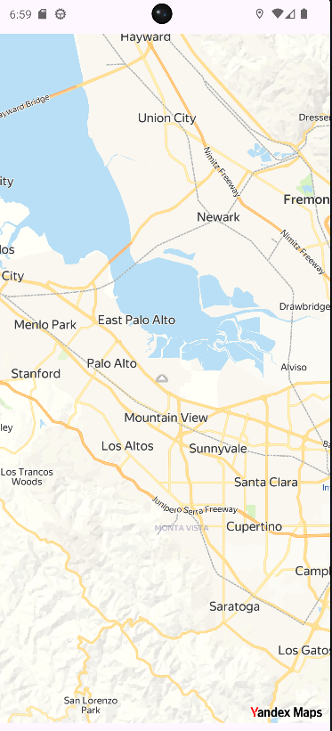
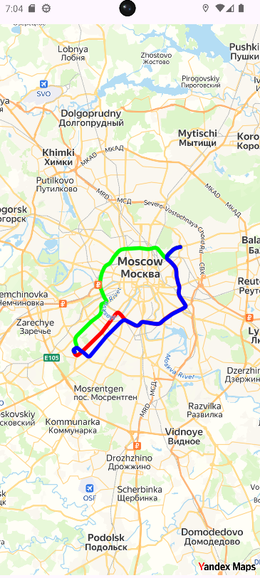
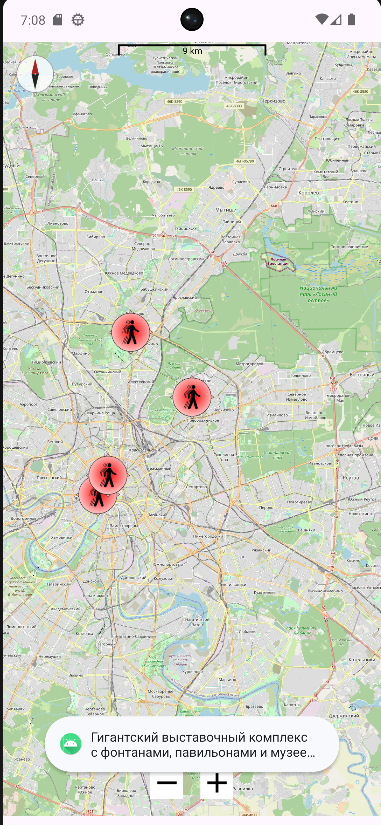

# Отчет по практической работе №8
## Дисциплина: Разработка мобильных приложений

**Выполнил:** Студент группы БСБО-09-23  
**ФИО:** Хречко Роман Викторович  
**Номер по списку:** 25

---

## 1. Цель работы
Изучить возможные способы интеграции картографических сервисов в Android-приложение,
а также освоение работы с картами, геолокацией пользователя, маркерами, дополнительными картографическими элементами и построением маршрутов.
В работе будут использоваться карты от `Yandex` и `OpenStreetMap`.
После этого реализовать изученные технологии в созданном ранее проекте `MireaProject`.

---

## 2. Выполнение модулей `Lesson8`

### 2.1 Модуль `yandexmaps` Подключение карт яндекс
**Задание:** Подключить `Yandex MapKit` к Android приложению.
- Добавить API ключ; 
- Добавить разрешения `ACCESS_COARSE_LOCATION` `ACCESS_FINE_LOCATION` `ACCESS_BACKGROUND_LOCATION` `INTERNET`;
- Добавить библиотеку для яндекс карт `implementation("com.yandex.android:maps.mobile:4.33.1-full")`;



**Листинг `MainActivity.java`:**
```Java
public class MainActivity extends AppCompatActivity implements UserLocationObjectListener {
    private static final int REQUEST_CODE_PERMISSION = 200;
    private ActivityMainBinding binding;
    private MapView mapView;

    private UserLocationLayer userLocationLayer;

    @Override
    protected void onCreate(Bundle savedInstanceState) {
        super.onCreate(savedInstanceState);
        EdgeToEdge.enable(this);
        MapKitFactory.initialize(this);
        binding = ActivityMainBinding.inflate(getLayoutInflater());
        setContentView(binding.getRoot());

        int internetPermissionStatus = ContextCompat.checkSelfPermission(this, Manifest.permission.INTERNET);
        int coarsePermissionStatus = ContextCompat.checkSelfPermission(this, Manifest.permission.ACCESS_COARSE_LOCATION);
        int finePermissionStatus = ContextCompat.checkSelfPermission(this, Manifest.permission.ACCESS_FINE_LOCATION);
        int backgroundPermissionStatus = ContextCompat.checkSelfPermission(this, Manifest.permission.ACCESS_BACKGROUND_LOCATION);

        if (internetPermissionStatus == PackageManager.PERMISSION_GRANTED &&
                coarsePermissionStatus == PackageManager.PERMISSION_GRANTED &&
                finePermissionStatus == PackageManager.PERMISSION_GRANTED &&
                backgroundPermissionStatus == PackageManager.PERMISSION_GRANTED)
        {

        }

        else {
            ActivityCompat.requestPermissions(this,
                    new String[]{Manifest.permission.ACCESS_COARSE_LOCATION,
                            Manifest.permission.ACCESS_FINE_LOCATION},
                    REQUEST_CODE_PERMISSION);
        }

        mapView = binding.mapview;
        mapView.getMap().move(
                new CameraPosition(new Point(55.751574, 37.573856), 11.0f, 0.0f, 0.0f),
                new Animation(Animation.Type.SMOOTH, 0),
                null);
        loadUserLocationLayer();

        ViewCompat.setOnApplyWindowInsetsListener(findViewById(R.id.main), (v, insets) -> {
            Insets systemBars = insets.getInsets(WindowInsetsCompat.Type.systemBars());
            v.setPadding(systemBars.left, systemBars.top, systemBars.right, systemBars.bottom);
            return insets;
        });
    }
    @Override
    protected void onStop() {
        super.onStop();
        // Вызов onStop нужно передавать инстансам MapView и MapKit.
        mapView.onStop();
        MapKitFactory.getInstance().onStop();
    }

    @Override
    protected void onStart() {
        // Вызов onStart нужно передавать инстансам MapView и MapKit.
        super.onStart();
        mapView.onStart();
        MapKitFactory.getInstance().onStart();
    }

    @Override
    public void onObjectAdded(UserLocationView userLocationView) {
        userLocationLayer.setAnchor(
                new PointF((float)(mapView.getWidth() * 0.5),
                        (float)(mapView.getHeight() * 0.5)),
                new PointF((float)(mapView.getWidth() * 0.5),
                        (float)(mapView.getHeight() * 0.83)));
// При определении направления движения устанавливается следующая иконка
        userLocationView.getArrow().setIcon(ImageProvider.fromResource(
                this, android.R.drawable.arrow_up_float));
// При получении координат местоположения устанавливается следующая иконка
        CompositeIcon pinIcon = userLocationView.getPin().useCompositeIcon();
        pinIcon.setIcon(
                "pin",
                ImageProvider.fromResource(this, android.R.drawable.arrow_down_float),
                new IconStyle().setAnchor(new PointF(0.5f, 0.5f))
                        .setRotationType(RotationType.ROTATE)
                        .setZIndex(1f)
                        .setScale(0.5f)
        );
        userLocationView.getAccuracyCircle().setFillColor(Color.BLUE & 0x99ffffff);
    }
    @Override
    public void onObjectRemoved(@NonNull UserLocationView userLocationView) {
    }
    @Override
    public void onObjectUpdated(@NonNull UserLocationView userLocationView, @NonNull ObjectEvent objectEvent) {
    }
    private void loadUserLocationLayer(){
        MapKit mapKit = MapKitFactory.getInstance();
        mapKit.resetLocationManagerToDefault();
        userLocationLayer = mapKit.createUserLocationLayer(mapView.getMapWindow());
        userLocationLayer.setVisible(true);
        userLocationLayer.setObjectListener(this);
    }
}
```
---

### 2.2 Модуль `YandexDriver` построение маршрута
**Задание:** Реализовать построение маршрута с помощью API от яндекс. Реализовать несколько различных маршрутов от одинаковых
начальных и конечных точек.

Был построен маршрут между двумя зданиями МИРЭА.




**Листинг `MainActivity.java`:**
```Java
public class MainActivity extends AppCompatActivity implements DrivingSession.DrivingRouteListener {
    private ActivityMainBinding binding;
    private final String MAPKIT_API_KEY = "19b554fc-3b4a-435a-a343-7aec6a8adf31";
    private final Point ROUTE_START_LOCATION = new Point(55.670005, 37.479894);
    private final Point ROUTE_END_LOCATION = new Point(55.794229, 37.700772);
    private final Point SCREEN_CENTER = new Point(
            (ROUTE_START_LOCATION.getLatitude() + ROUTE_END_LOCATION.getLatitude()) / 2,
            (ROUTE_START_LOCATION.getLongitude() + ROUTE_END_LOCATION.getLongitude()) / 2);
    private MapView mapView;
    private MapObjectCollection mapObjects;
    private DrivingRouter drivingRouter;
    private DrivingSession drivingSession;
    private static final int REQUEST_CODE_PERMISSION = 200;
    private final int[] colors = {0xFFFF0000, 0xFF00FF00, 0x00FFBBBB, 0xFF0000FF};
    private final InputListener inputListener = new InputListener() {
        @Override
        public void onMapTap(@NonNull Map map, @NonNull Point point) {
            touchScreen();
            Log.d("MIREA", "---Map Tap---");
        }

        @Override
        public void onMapLongTap(@NonNull Map map, @NonNull Point point) {
        }
    };


    @Override
    protected void onCreate(Bundle savedInstanceState) {
        super.onCreate(savedInstanceState);
        EdgeToEdge.enable(this);
        MapKitFactory.initialize(this);
        binding = ActivityMainBinding.inflate(getLayoutInflater());
        setContentView(binding.getRoot());
        int internetPermissionStatus = ContextCompat.checkSelfPermission(this, Manifest.permission.INTERNET);
        int coarsePermissionStatus = ContextCompat.checkSelfPermission(this, Manifest.permission.ACCESS_COARSE_LOCATION);
        int finePermissionStatus = ContextCompat.checkSelfPermission(this, Manifest.permission.ACCESS_FINE_LOCATION);
        int backgroundPermissionStatus = ContextCompat.checkSelfPermission(this, Manifest.permission.ACCESS_BACKGROUND_LOCATION);

        if (internetPermissionStatus != PackageManager.PERMISSION_GRANTED ||
                coarsePermissionStatus != PackageManager.PERMISSION_GRANTED ||
                finePermissionStatus != PackageManager.PERMISSION_GRANTED)
        {
            ActivityCompat.requestPermissions(this,
                    new String[]{Manifest.permission.ACCESS_COARSE_LOCATION,
                            Manifest.permission.ACCESS_FINE_LOCATION},
                    REQUEST_CODE_PERMISSION);
        }

        mapView = binding.mapview;
        mapView.getMap().setRotateGesturesEnabled(false);
        // Устанавливаем начальную точку и масштаб
        mapView.getMap().move(new CameraPosition(SCREEN_CENTER, 10, 0, 0));

        // Добавляем слушатель нажатий на карту
        mapView.getMap().addInputListener(inputListener);

        // Инициализируем объект для создания маршрута водителя
        drivingRouter = DirectionsFactory.getInstance().createDrivingRouter(DrivingRouterType.COMBINED);
        mapObjects = mapView.getMap().getMapObjects().addCollection();
        submitRequest();
        ViewCompat.setOnApplyWindowInsetsListener(findViewById(R.id.main), (v, insets) -> {
            Insets systemBars = insets.getInsets(WindowInsetsCompat.Type.systemBars());
            v.setPadding(systemBars.left, systemBars.top, systemBars.right, systemBars.bottom);
            return insets;
        });
    }

    @Override
    protected void onStop() {
        mapView.onStop();
        MapKitFactory.getInstance().onStop();
        super.onStop();
    }

    @Override
    protected void onStart() {
        super.onStart();
        MapKitFactory.getInstance().onStart();
        mapView.onStart();
    }

    private void submitRequest() {
        DrivingOptions drivingOptions = new DrivingOptions();
        VehicleOptions vehicleOptions = new VehicleOptions();
        // Кол-во альтернативных путей
        drivingOptions.setRoutesCount(4);
        ArrayList<RequestPoint> requestPoints = new ArrayList<>();
        // Установка точек маршрута
        requestPoints.add(new RequestPoint(ROUTE_START_LOCATION, RequestPointType.WAYPOINT, null, null, null));
        requestPoints.add(new RequestPoint(ROUTE_END_LOCATION, RequestPointType.WAYPOINT, null, null, null));
        // Отправка запроса на сервер
        drivingSession = drivingRouter.requestRoutes(requestPoints, drivingOptions, vehicleOptions, this);
    }

    @Override
    public void onDrivingRoutes(@NonNull List<DrivingRoute> list) {
        int color;
        for (int i = 0; i < list.size(); i++) {
            // настраиваем цвета для каждого маршрута
            color = colors[i];
            // добавляем маршрут на карту
            mapObjects.addPolyline(list.get(i).getGeometry()).setStrokeColor(color);
        }
    }

    @Override
    public void onDrivingRoutesError(@NonNull com.yandex.runtime.Error error) {
        String errorMessage = getString(R.string.unknown_error_message);
        if (error instanceof RemoteError) {
            errorMessage = getString(R.string.remote_error_message);
        } else if (error instanceof NetworkError) {
            errorMessage = getString(R.string.network_error_message);
        }
        Toast.makeText(this, errorMessage, Toast.LENGTH_SHORT).show();
    }

    private void touchScreen() {
        PlacemarkMapObject marker = mapView.getMap().getMapObjects().addPlacemark(new
                Point(55.751574, 37.573856), ImageProvider.fromResource(this, android.R.drawable.arrow_down_float));
        marker.addTapListener((mapObject, point) -> {
            Toast.makeText(getApplication(), "Marker click",
                    Toast.LENGTH_SHORT).show();
            return false;
        });
    }
}
```

---

### 2.3 Модуль `OSMMaps`
**Задание:** Реализовать карту Москвы с помощью `OpenStreetMap`, добавить несколько точек, при нажатии на которые будет
выведен текст описание. Добавить масштабирование, компас, шкалу масштаба.



**Листинг класса `MainActivity.java`:**
```Java
public class MainActivity extends AppCompatActivity {

    private MapView mapView = null;
    private ActivityMainBinding binding;

    @Override
    protected void onCreate(Bundle savedInstanceState) {
        super.onCreate(savedInstanceState);
        EdgeToEdge.enable(this);
        Configuration.getInstance().load(getApplicationContext(),
                PreferenceManager.getDefaultSharedPreferences(getApplicationContext()));
        binding = ActivityMainBinding.inflate(getLayoutInflater());
        setContentView(binding.getRoot());
        mapView = binding.mapView;
        mapView.setZoomRounding(true);
        mapView.setMultiTouchControls(true);
        IMapController mapController = mapView.getController();
        mapController.setZoom(15.0);
        GeoPoint startPoint = new GeoPoint(55.794229, 37.700772);
        mapController.setCenter(startPoint);
        MyLocationNewOverlay locationNewOverlay = new MyLocationNewOverlay(new
                GpsMyLocationProvider(getApplicationContext()),mapView);
        locationNewOverlay.enableMyLocation();
        mapView.getOverlays().add(locationNewOverlay);

        CompassOverlay compassOverlay = new CompassOverlay(getApplicationContext(), new
                InternalCompassOrientationProvider(getApplicationContext()), mapView);
        compassOverlay.enableCompass();
        mapView.getOverlays().add(compassOverlay);

        final Context context = this.getApplicationContext();
        final DisplayMetrics dm = context.getResources().getDisplayMetrics();
        ScaleBarOverlay scaleBarOverlay = new ScaleBarOverlay(mapView);
        scaleBarOverlay.setCentred(true);
        scaleBarOverlay.setScaleBarOffset(dm.widthPixels / 2, 10);
        mapView.getOverlays().add(scaleBarOverlay);

        AddMarker(
                new GeoPoint(55.794229, 37.700772),
                "РТУ МИРЭА",
                "Учебный корпус и интересное место для учебы"
        );
        AddMarker(
                new GeoPoint(55.829962, 37.640809),
                "ВДНХ",
                "Гигантский выставочный комплекс с фонтанами, павильонами и музеем космонавтики"
        );
        AddMarker(
                new GeoPoint(55.740557, 37.608502),
                "Музей современного искусства «Гараж»",
                "Музей современного искусства в парке Горького, здание от Рема Колхаса"
        );
        AddMarker(
                new GeoPoint(55.751244, 37.618423),
                "Красная площадь",
                "Главная площадь страны, здесь находятся Кремль, Храм Василия Блаженного и Мавзолей"
        );
        ViewCompat.setOnApplyWindowInsetsListener(findViewById(R.id.main), (v, insets) -> {
            Insets systemBars = insets.getInsets(WindowInsetsCompat.Type.systemBars());
            v.setPadding(systemBars.left, systemBars.top, systemBars.right, systemBars.bottom);
            return insets;
        });
    }

    private void AddMarker(GeoPoint point, String title, String text){
        Marker marker = new Marker(mapView);
        marker.setPosition(point);
        marker.setOnMarkerClickListener(new Marker.OnMarkerClickListener() {
            public boolean onMarkerClick(Marker marker, MapView mapView) {
                Toast.makeText(getApplicationContext(),text,
                        Toast.LENGTH_SHORT).show();
                return true;
            }
        });
        mapView.getOverlays().add(marker);
        marker.setIcon(ResourcesCompat.getDrawable(getResources(), org.osmdroid.library.
                R.drawable.osm_ic_follow_me_on, null));
        marker.setTitle(title);
    }

    @Override
    public void onResume() {
        super.onResume();
        Configuration.getInstance().load(getApplicationContext(),
                PreferenceManager.getDefaultSharedPreferences(getApplicationContext()));
        if (mapView != null) {
            mapView.onResume();
        }
    }

    @Override
    public void onPause() {
        super.onPause();
        Configuration.getInstance().save(getApplicationContext(),
                PreferenceManager.getDefaultSharedPreferences(getApplicationContext()));
        if (mapView != null) {
            mapView.onPause();
        }
    }
}
```

---

## 3. Дополнительное задание `MireaProject`
**Задание:** Реализовать карту во фрагмента проекта. Добавить одну дополнительную функцию из разобранных. Добавить маркеры с
интересными местами и их описанием.

Карта была реализована с помощью `OpenStreetMap`, а в качестве дополнительной функции был выбран компас. 
Для фрагмента были настроены значения для корректной работы в проекте и навигации по списку всех фрагментов.

**Листинг `InterestingPlacesFragment.java`:**
```Java
public class InterestingPlacesFragment extends Fragment {
    private MapView mapView;

    @Override
    public void onCreate(@Nullable Bundle savedInstanceState) {
        super.onCreate(savedInstanceState);
        Configuration.getInstance().setUserAgentValue(requireContext().getPackageName());
    }

    @Nullable
    @Override
    public View onCreateView(@NonNull LayoutInflater inflater, @Nullable ViewGroup container, @Nullable Bundle savedInstanceState) {
        View root = inflater.inflate(R.layout.fragment_ineresting_places, container, false);
        mapView = root.findViewById(R.id.mapView);
        mapView.setTileSource(TileSourceFactory.MAPNIK);
        mapView.setMultiTouchControls(true);

        IMapController mapController = mapView.getController();
        mapController.setZoom(15.0);
        GeoPoint startPoint = new GeoPoint(55.6700, 37.4800); // Near MIREA
        mapController.setCenter(startPoint);

        // Add Compass
        CompassOverlay compassOverlay = new CompassOverlay(getContext(), new InternalCompassOrientationProvider(getContext()), mapView);
        compassOverlay.enableCompass();
        mapView.getOverlays().add(compassOverlay);

        // Add Establishments
        addMarker(55.794229, 37.700772,
                "РТУ МИРЭА", "Учебный корпус и интересное место для учебы");
        addMarker(55.829962, 37.640809,
                "ВДНХ", "Гигантский выставочный комплекс с фонтанами, павильонами и музеем космонавтики");
        addMarker(55.740557, 37.608502,
                "Музей современного искусства «Гараж»", "Музей современного искусства в парке Горького, здание от Рема Колхаса");
        addMarker(55.751244, 37.618423,
                "Красная площадь", "Главная площадь страны, здесь находятся Кремль, Храм Василия Блаженного и Мавзолей");
        return root;
    }

    private void addMarker(double latitude, double longitude, String title, String description) {
        Marker marker = new Marker(mapView);
        marker.setPosition(new GeoPoint(latitude, longitude));
        marker.setAnchor(Marker.ANCHOR_CENTER, Marker.ANCHOR_BOTTOM);
        marker.setTitle(title);
        marker.setSnippet(description);
        mapView.getOverlays().add(marker);
    }

    @Override
    public void onResume() {
        super.onResume();
        mapView.onResume();
    }

    @Override
    public void onPause() {
        super.onPause();
        mapView.onPause();
    }
}
```

---

## 4. Вывод
В ходе работы были изучены возможности интеграции картографических сервисов в Android-приложения.
Были реализованы следующие модули:
- Простая карта от яндекс;
- Построение маршрута между точками с помощью API яндекса;
- Карта с маркерами объектов с помощью `OpenStreetMap`.

После этого изученные возможности были реализованы в проекте `MireaProject` в виде дополнительного фрагмента с картой с использованием `OSM`.